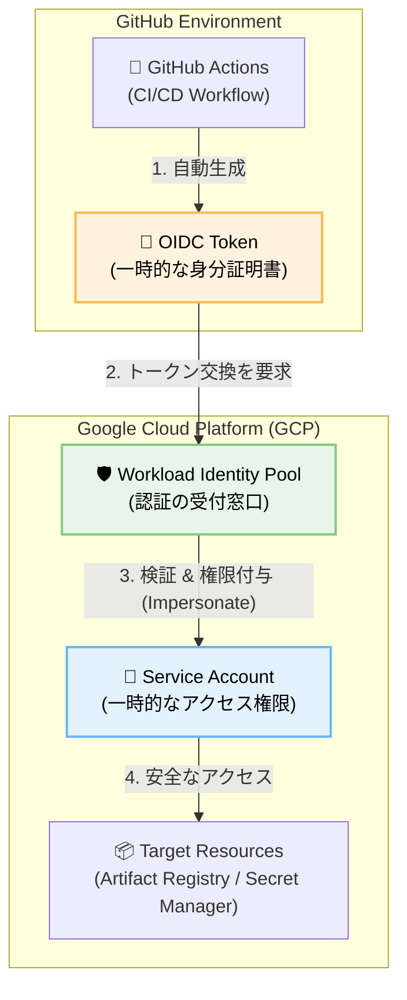
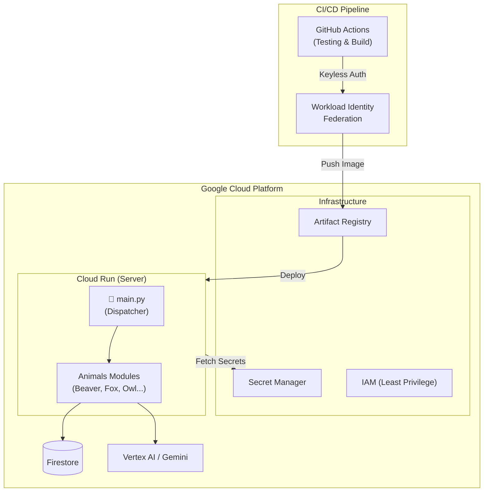

# 🤖 My LINE Bots Collection (Animal Agents)


[](https://usagi-oekaki-service-1032484155743.asia-northeast1.run.app)
[](https://usagi-oekaki-service-1032484155743.asia-northeast1.run.app/docs)

> [!NOTE]
> ✨ <a href="https://usagi-oekaki-service-1032484155743.asia-northeast1.run.app" target="_blank"><strong>Live Demo Portal / **デモサイトはこちら** </strong></a> ✨
> <br>
> BOTたちが集まるポータルサイトを公開しました！(PC / Mobile 対応)

## API Documentation

📖 [Swagger UI](https://usagi-oekaki-service-1032484155743.asia-northeast1.run.app/docs)

※一部のAPIはデモ用にレート制限をかけています

**個性豊かなAIどうぶつたちが、あなたのLINE生活をサポートします。**

このリポジトリは、Google Gemini 2.5 (Flash/Pro) と Google Cloud (Cloud Run, Firestore, Vertex AI) をフル活用した、実用的なLINEボットの集合体です。
リマインダー、画像生成、天気予報、メール代行など、**それぞれの動物が「得意分野」を持ったマイクロモジュール**として実装されています。

### 🚀 DevOps Highlights (Implemented Jan 2026)
本プロジェクトは、Google Cloud が推奨する **「エンタープライズグレードのDevOpsベストプラクティス」** を個人開発に適用しています。

*   **Secure CI/CD**: GitHub Actions × Workload Identity Federation (Keyless Auth)
*   **Infrastructure**: Artifact Registry, Secret Manager
*   **Test Strategy**: Core Logic Coverage 80%+, Hermetic Testing with Mocking



---

## 🧩 Design Philosophy (デザイン哲学)
**「無機質な便利ツールではなく、毎日の生活に寄り添うパートナーを」**

*   **なぜ「動物」なのか？**
    *   AIの回答は時に固くなりがちですが、フクロウ教授や星くじらのような「キャラクター」を通すことで、親しみやすく、感情移入しやすいインターフェースを目指しました。
*   **なぜ「LINE」なのか？**
    *   新しいアプリをインストールする必要がなく、誰もが使い慣れたチャット画面で最先端のAI機能にアクセスできる「Accessibility（アクセシビリティ）」を最優先しました。

---

## 🐾 ボット一覧 (Agents List)

各ボットは `animals/` ディレクトリ内で個別のモジュールとして管理されています。

| アイコン | 名前 | 役割・機能 | 技術スタック |
| :---: | :--- | :--- | :--- |
|  | **まめなビーバーメモ🦫**<br>[(Beaver)](animals/beaver.md) | **予定管理 & OCR**<br>学校のプリントを写真で送るだけで、AIが予定を抽出してリマインド。 | `Gemini Vision` `Firestore` `GAS` |
|  | **アライグマのお片付け🦝**<br>[(Raccoon)](animals/raccoon.md) | **お片付けバトル & 診断**<br>部屋の写真を撮ってモンスターと戦ったり、AIが片付けタスクを提案します。 | `Gemini Vision` `FastAPI` |
|  | **キツネくんの動画要約🦊**<br>[(Fox)](animals/fox.md) | **動画要約 & 検索**<br>YouTube動画の内容を要約し、関連情報を検索して深掘り解説。 | `GenAI SDK` `Grounding with Search` |
|  | **フクロウ教授画像生成🦉**<br>[(Owl)](animals/owl.md) | **画像生成 & 健康**<br>「〜の絵を描いて」で即座に画像生成。カロリー計算もお手の物。 | `Imagen 3` `Matplotlib` |
|  | **☀️カエルくんのお天気予報🐸**<br>[(Frog)](animals/frog.md) | **天気 & 外出支援**<br>毎朝の天気予報と、位置情報から周辺のおすすめスポットを紹介。 | `Google Maps API` `GAS` |
|  | **スーパー秘書ペンギン🐧**<br>[(Penguin)](animals/penguin.md) | **メール代行 & 接待**<br>用件を送るだけでビジネスメールを作成・送信。接待のお店選びも。 | `Gmail API` `Search` |
|  | **AIトピックのカピバラ解説**<br>[(Capybara)](animals/capybara.md) | **ニュース解説**<br>最新のAIニュースなどを検索し、分かりやすく要約・解説。 | `Google Search` |
|  | **もぐら駅長**<br>[(Mole)](animals/mole.md) | **交通案内**<br>駅の時刻表や乗り換え案内をサポート。 | `Train Logic` |
|  | **🤖おしゃべりVoidollねこ🐱**<br>[(Voidoll)](animals/voidoll.md) | **音声対話 (Desktop App)**<br>FletによるWindowsネイティブアプリ。遅延のない音声会話を実現。 | `Python (Flet)` `Vertex AI` `Winsound` |
|  | **星くじらからの光の便り🐋💫**<br>[(Whale)](animals/whale.md) | **癒やし & 宇宙**<br>NASAのAPIを使って、美しい宇宙の写真や情報を届ける。 | `NASA API` |
|  | **コウモリの番組お知らせ🦇**<br>[(Bat)](animals/bat.md) | **番組通知**<br>指定したタレントやキーワードのTV出演情報を毎朝通知。 | `Web Scraping` |
|  | **アルパカのまつエクサロン🦙**<br>[(Alpaca)](animals/alpaca.md) | **まつエクシミュレーション**<br>写真でまつげエクステの仕上がりをAIシミュレーション。 | `Face Mesh` `Canvas` |
|  | **姿勢のフラミンゴ先生**<br>[(Flamingo)](animals/flamingo.md) | **姿勢矯正 & ゲーム**<br>エッジAIで姿勢の歪みをチェック＆片足バランスゲーム。完全無料・安心設計。 | `MediaPipe` `Client-Side AI` |
|  | **美の蝶々パーソナル🦋**<br>[(Butterfly)](animals/butterfly.md) | **パーソナルカラー & 顔タイプ**<br>AIが似合うシーズンカラーと顔型に合う髪型を診断。 | `Gemini 2.5` `FastAPI` |
|  | **リスのほっぺたどんぐりゲーム🐿️**<br>[(Squirrel)](animals/squirrel.md) | **対戦アクションゲーム**<br>カメラで手を認識し、落ちてくるどんぐりをキャッチしてほっぺたを膨らませる2人対戦ゲーム。 | `MediaPipe Hands` `Canvas` `Web Audio` |
|  | **カラフルお魚のお部屋水族館🐠**<br>[(Fish)](animals/fish.md) | **バーチャル水族館**<br>手で魚と触れ合える癒やしの空間。サメやタコも登場します。 | `MediaPipe Hands` `Canvas` `Audio` |
|  | **見守りレトリバー🐕**<br>[(Retriever)](static/retriever.html) | **年齢換算 & 健康**<br>ペットの年齢を人間に換算し、ライフステージに合わせた健康アドバイスを提供。 | `FastAPI` `Vanilla JS` |

## 👉 **[詳細ドキュメントとデモはこちら (animals/README.md)](animals/README.md)**

---

## 🏗 アーキテクチャ & DevOps

本プロジェクトは、機能の独立性と開発の堅牢性を両立させるモダンなアーキテクチャを採用しています。



### 工夫した点
*   **モジュール分割**: 当初は1つのファイル(`main.py`)でしたが、コードが1500行を超えて保守不能になったため、動物ごとにファイルを分割しました。（[詳細記事: Zenn](https://zenn.dev/miki_mini/articles/30264063ad4b7d)）
*   **Security First**: 機密情報は `Secret Manager` で管理し、GitHub Actions は `Workload Identity Federation` で認証。Gitリポジトリに認証キーを含めない「キーレス運用」を実現。
*   **Automated Quality**: `pytest` による自動テストを導入。特にAI生成ロジックやDB操作はモック化し、外部依存を排除したテストを行っています（カバレッジ目標 80%+）。
*   **Infrastructure as Code (IaC)**: Terraform を用いて全リソース（Cloud Run, Artifact Registry, IAM, Secret Manager）をコード定義。プロビジョニングの自動化と再現性を担保しています。
*   **Remote State Management**: Terraform の状態ファイル (`tfstate`) は Google Cloud Storage (GCS) で安全に暗号化して管理し、整合性を保ちながら運用しています。

---

## 🛠 開発環境・セットアップ

このプロジェクトは `FastAPI` で動作しています。

### 必要要件
*   Python 3.10+
*   Google Cloud Project (Vertex AI / Firestore enabled)
*   LINE Messaging API Channels

### インストール

```bash
# リポジトリのクローン
git clone https://github.com/miki-mini/my-line-bots.git
cd my-line-bots

# 依存関係のインストール
pip install -r requirements.txt
```

### 環境変数 (.env)
ローカル開発時はルートディレクトリに `.env` ファイルを作成します。本番環境では **Secret Manager** から自動注入されます。

```ini
GCP_PROJECT_ID=your-project-id
# ... (その他シークレットキー)
```

### ローカル起動

```bash
uvicorn main:app --reload
```

### テストの実行

```bash
# 全てのテストを実行（カバレッジレポート付き）
pytest --cov=. --cov-report=term-missing

# 特定のファイルのテストを実行
pytest tests/test_bat.py
```

---

## 🔗 関連リンク

*   **Zenn**: 開発の裏話や技術解説記事を投稿しています。[miki-miniのZenn記事一覧](https://zenn.dev/miki_mini)

---

English Summary

Concept: A versatile collection of AI-powered LINE bots ("Animal Agents") designed to assist with daily tasks through a friendly interface.

Technical Stack: Built with FastAPI, Google Gemini, and Google Cloud (Cloud Run/Firestore), implementing enterprise-grade DevOps practices like CI/CD with Workload Identity Federation.

Key Features: Includes modular micro-services for OCR memo management, YouTube summarization, image generation (Imagen 3), and posture checking via MediaPipe.

---

Developed by **miki-mini**