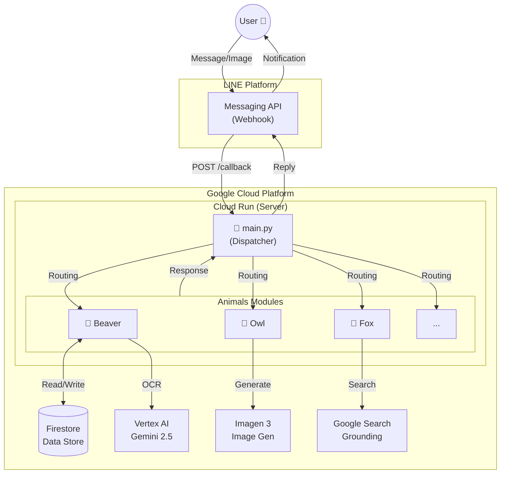

# 🤖 My LINE Bots Collection (Animal Agents)


> [!NOTE]
> ✨ **[Live Demo Portal / デモサイトはこちら](https://usagi-oekaki-service-1032484155743.asia-northeast1.run.app)** ✨
> ボットたちが集まるポータルサイトを公開しました！(PC / Mobile 対応)

## API Documentation

📖 [Swagger UI](https://usagi-oekaki-service-1032484155743.asia-northeast1.run.app/docs)

※一部のAPIはデモ用にレート制限をかけています

**個性豊かなAIどうぶつたちが、あなたのLINE生活をサポートします。**

このリポジトリは、Google Gemini 2.5 (Flash/Pro) と Google Cloud (Cloud Run, Firestore, Vertex AI) をフル活用した、実用的なLINEボットの集合体です。
リマインダー、画像生成、天気予報、メール代行など、**それぞれの動物が「得意分野」を持ったマイクロモジュール**として実装されています。

---

## 🐾 ボット一覧 (Agents List)

各ボットは `animals/` ディレクトリ内で個別のモジュールとして管理されています。

| アイコン | 名前 | 役割・機能 | 技術スタック |
| :---: | :--- | :--- | :--- |
|  | **まめなビーバー**<br>[(Beaver)](animals/beaver.md) | **予定管理 & OCR**<br>学校のプリントを写真で送るだけで、AIが予定を抽出してリマインド。 | `Gemini Vision` `Firestore` `GAS` |
|  | **キツネくん**<br>[(Fox)](animals/fox.md) | **動画要約 & 検索**<br>YouTube動画の内容を要約し、関連情報を検索して深掘り解説。 | `GenAI SDK` `Grounding with Search` |
|  | **フクロウ教授**<br>[(Owl)](animals/owl.md) | **画像生成 & 健康**<br>「〜の絵を描いて」で即座に画像生成。カロリー計算もお手の物。 | `Imagen 3` `Matplotlib` |
|  | **カエルくん**<br>[(Frog)](animals/frog.md) | **天気 & 外出支援**<br>毎朝の天気予報と、位置情報から周辺のおすすめスポットを紹介。 | `Google Maps API` `GAS` |
|  | **秘書ペンギン**<br>[(Penguin)](animals/penguin.md) | **メール代行 & 接待**<br>用件を送るだけでビジネスメールを作成・送信。接待のお店選びも。 | `Gmail API` `Search` |
|  | **カピバラ**<br>[(Capybara)](animals/capybara.md) | **ニュース解説**<br>最新のAIニュースなどを検索し、分かりやすく要約・解説。 | `Google Search` |
|  | **もぐら駅長**<br>[(Mole)](animals/mole.md) | **交通案内**<br>駅の時刻表や乗り換え案内をサポート。 | `Train Logic` |
|  | **Voidoll**<br>[(Voidoll)](animals/voidoll.md) | **音声対話**<br>テキストだけでなく、音声ファイルでの自然な会話が可能。 | `Audio Processing` |
|  | **星くじら**<br>[(Whale)](animals/whale.md) | **癒やし & 宇宙**<br>NASAのAPIを使って、美しい宇宙の写真や情報を届ける。 | `NASA API` |
|  | **TVコウモリ**<br>[(Bat)](animals/bat.md) | **番組通知**<br>指定したタレントやキーワードのTV出演情報を毎朝通知。 | `Web Scraping` |

👉 **[詳細ドキュメントとデモはこちら (animals/README.md)](animals/README.md)**

---

## 🏗 アーキテクチャ (Architecture)

**「管理人室 (main.py)」** がLINEからの全リクエストを受け取り、適切な **「動物の部屋 (Modules)」** に振り分けるディスパッチャーパターンを採用しています。これにより、機能追加や修正が他のボットに影響を与えません。



### 工夫した点
*   **モジュール分割**: 当初は1つのファイル(`main.py`)でしたが、コードが1500行を超えて保守不能になったため、動物ごとにファイルを分割しました。（[詳細記事: Zenn](https://zenn.dev/miki_mini/articles/30264063ad4b7d)）
*   **Search Grounding**: Vertex AIのGrounding機能を使用し、最新情報に基づいた回答を実現しています（キツネ、カピバラ）。
*   **Vision & OCR**: Geminiの画像認識能力を使い、非構造データ（チラシ）を構造データ（カレンダー予定）に変換しています（ビーバー）。

---

## 🛠 開発環境・セットアップ

このプロジェクトは `FastAPI` で動作しています。

### 必要要件
*   Python 3.10+
*   Google Cloud Project (Vertex AI / Firestore enabled)
*   LINE Messaging API Channels

### インストール

```bash
# リポジトリのクローン
git clone https://github.com/miki-mini/my-line-bots.git
cd my-line-bots

# 依存関係のインストール
pip install -r requirements.txt
```

### 環境変数 (.env)
ルートディレクトリに `.env` ファイルを作成し、以下のキーを設定してください。

```ini
GCP_PROJECT_ID=your-project-id
GCS_BUCKET_NAME=your-bucket-name
GEMINI_API_KEY=your-api-key

# 各ボットのLINE Token
BEAVER_ACCESS_TOKEN=...
BEAVER_CHANNEL_SECRET=...
# (他ボットも同様)
```

### ローカル起動

```bash
uvicorn main:app --reload
```

---

## 🔗 関連リンク

*   **Zenn**: 開発の裏話や技術解説記事を投稿しています。[miki-miniのZenn記事一覧](https://zenn.dev/miki_mini)


---

Developed by **miki-mini**