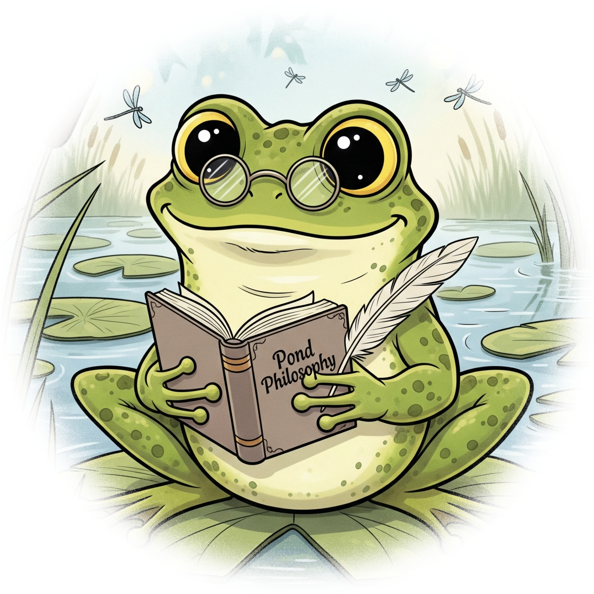
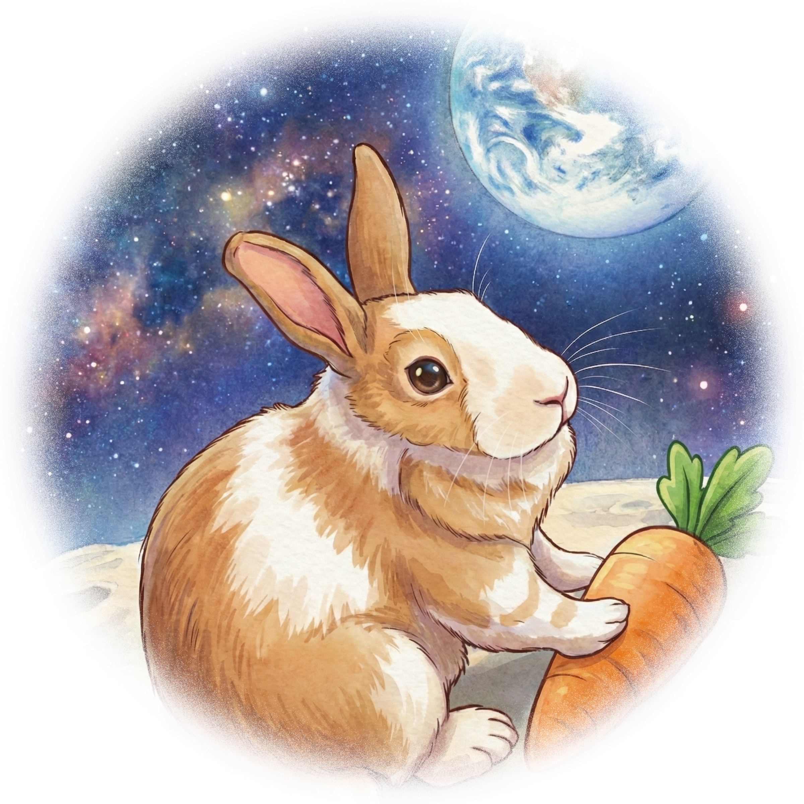
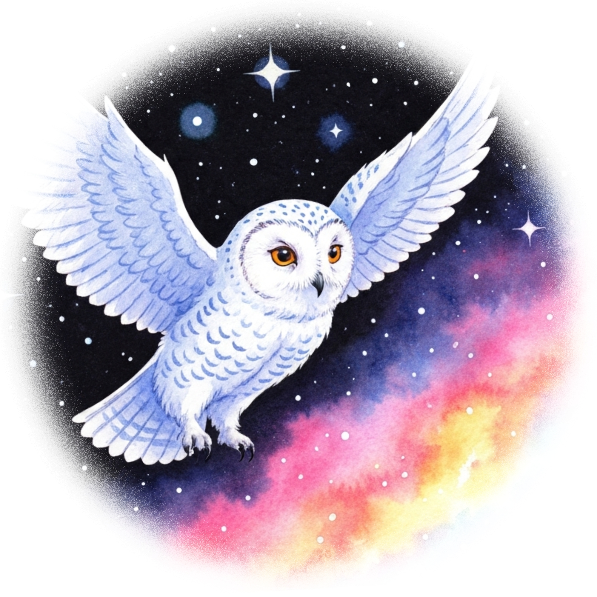

# 🤖 My LINE Bots Collection (どうぶつAIボット集)

Python と Google Gemini API を活用した、多機能なLINEボットたちのコード集です。
それぞれのボットが異なる個性と機能を持っています。

## 🐾 ボット一覧 (Bot List)

| アイコン | 名前 | 機能 | ファイル |
| :---: | :--- | :--- | :--- |
|  | **キツネくんの動画要約🦊** (Fox YouTube) | **YouTube動画要約 & 検索** 動画の内容をAIが解説し、Google検索で補足情報を教えてくれます。 | [🐍 Python](fox.py) [📜 説明書](fox.md) |
|  | **☀️カエルくんのお天気予報🐸** (Weather Frog) | **天気予報 & Googleマップ** 毎朝のお天気と服装情報通知＋位置情報から天気や周辺情報を教えてくれます。 | [🐍 Python](frog.py) [📜 説明書](frog.md)  [🚀 GAS](gas/frog_morning.js) |
|  | **スーパー秘書ペンギン🐧** (Secretary Penguin) | **メール送信代行 ＆ 接待コンシェルジュ** 宛先と本文を送るとメールを代行送信します。接待のお店や手土産選びの相談も可能です。 | [🐍 Python](penguin.py)  [📜 説明書](penguin.md)  [🚀 GAS](gas/mail_sender.gs) |
|  | **月うさぎからのおくりもの🐇🌝** (Moon Rabbit) | **生活習慣記録 & 育成** 「おはよう」でポイントが貯まる育成ゲーム機能付き。 | [🐰 GitHubを開く](https://github.com/miki-mini/moon-rabbit) |
|  | **まめなビーバーメモ🦫** (Beaver Memo) | **リマインダー & 予定抽出** 決まった時間の通知や、画像から予定を読み取って通知します。 | *Coming Soon...* |
|  | **AIトピックのカピバラ解説** (Capybara News) | **AIニュース要約** 毎朝、最新のAIニュースを要約して届けてくれます。 | [🐍 Python](capybara.py) [📜 説明書](capybara.md) |
|  | **フクロウ教授画像生成🦉** (Professor Owl) | **画像生成 & 健康管理** 画像生成や、カロリー計算・体重管理のグラフ化を行います。 | *Coming Soon...* |
|  | **おしゃべりVoidoll** (Chat Voidoll) | **音声会話** テキストだけでなく、音声での自然な会話が楽しめます。 | *Coming Soon...* |
|  | **もぐら駅長🦡** (Station Master Mole) | **時刻表 & 駅検索** 駅名の時刻表や、Googleマップでの場所案内をします。 | *Coming Soon...* |
|  | **星くじらからの光の便り🐋💫** (Star Whale) | **天体観測** ジェイムズ・ウェッブの写真をLINEに送信してくれます。 | *Coming Soon...* |

## 🛠 全体で使用している技術

* **言語**: Python 3.10+
* **AI**: Google Gemini 2.5 Pro / Flash
* **基盤**: Google Cloud Run / FastAPI
* **PF**: LINE Messaging API

---
Creator: miki-mini