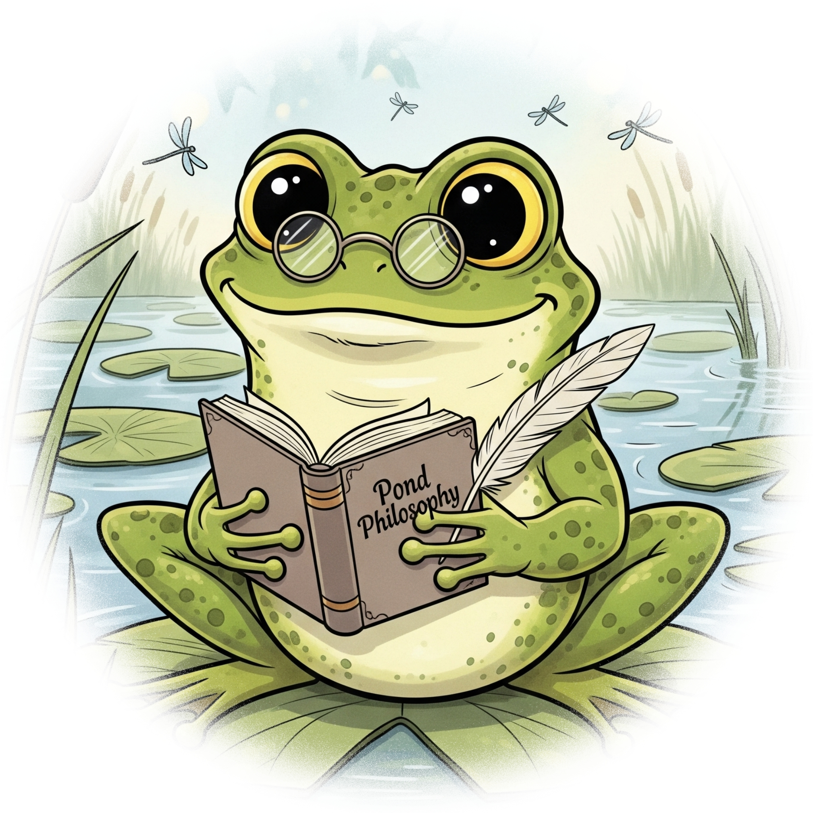
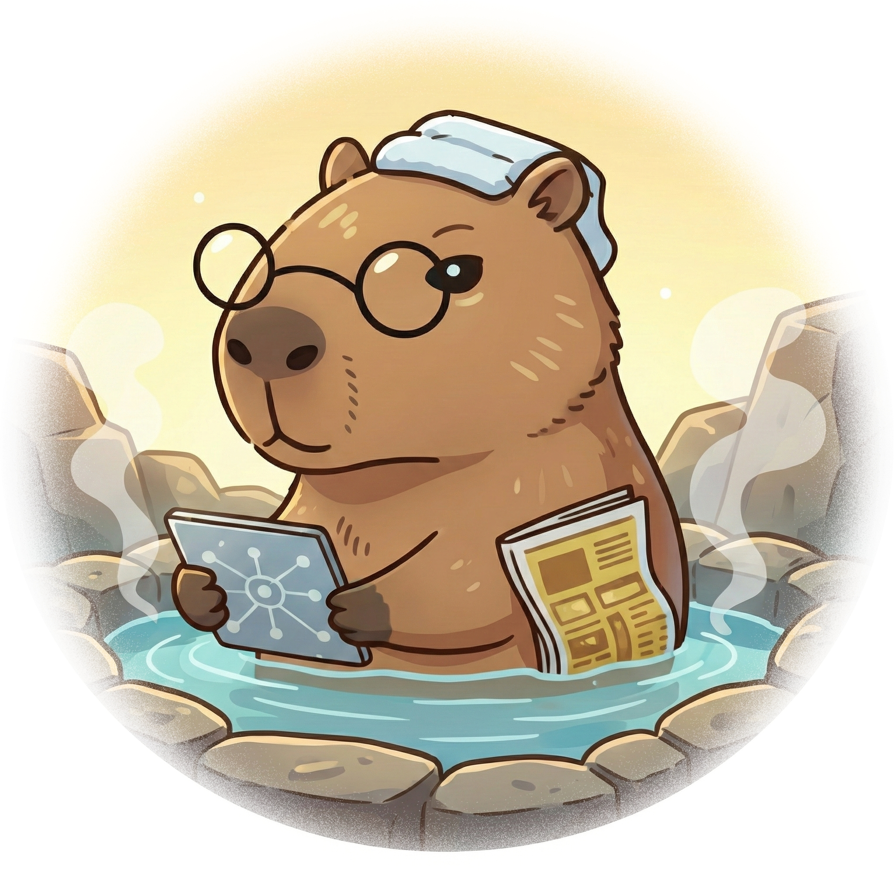
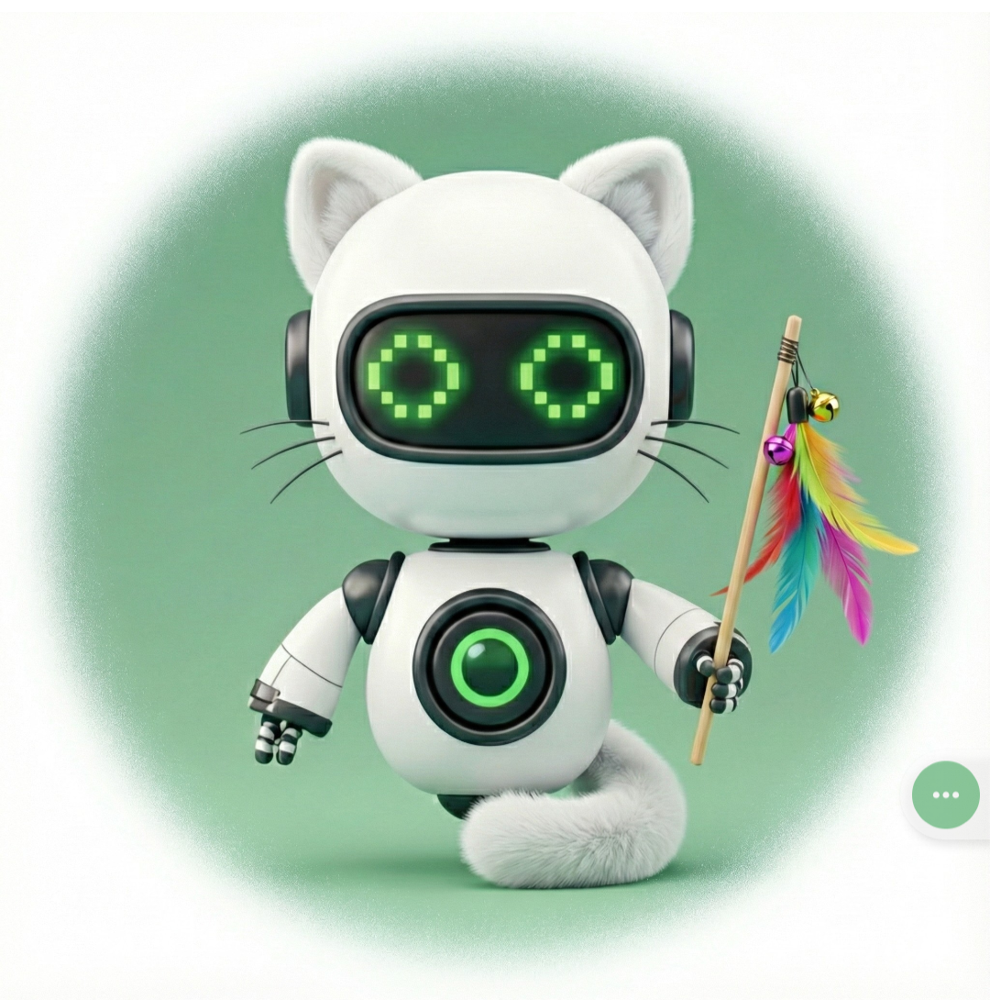
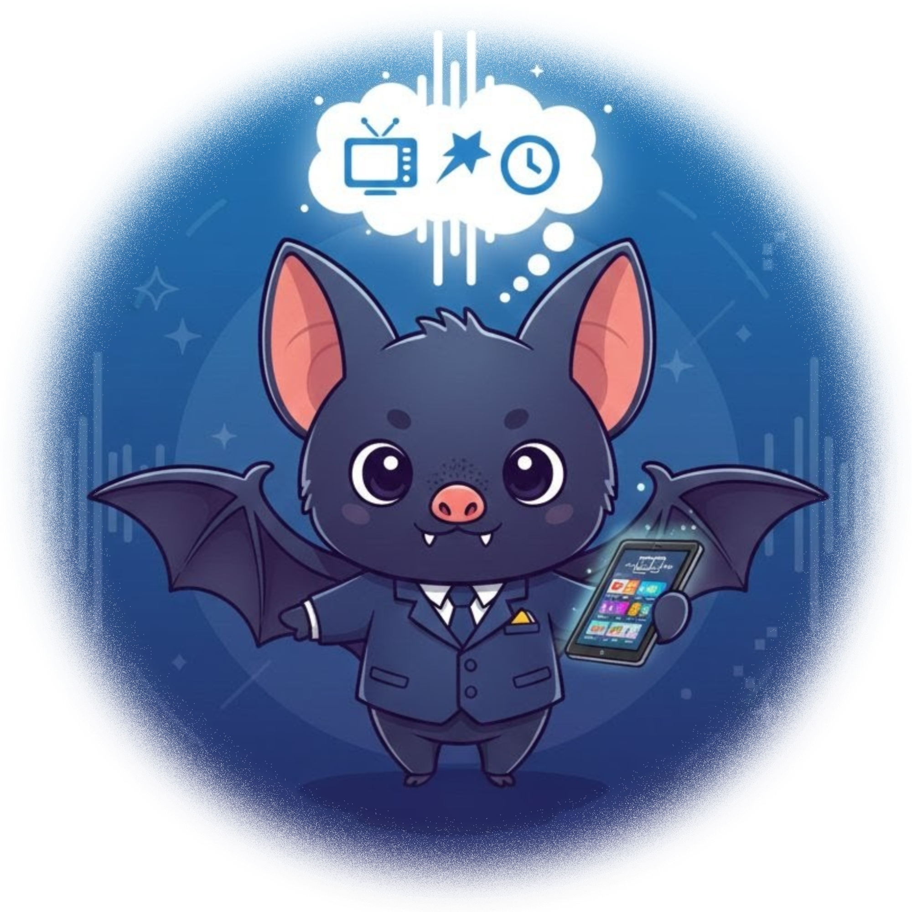
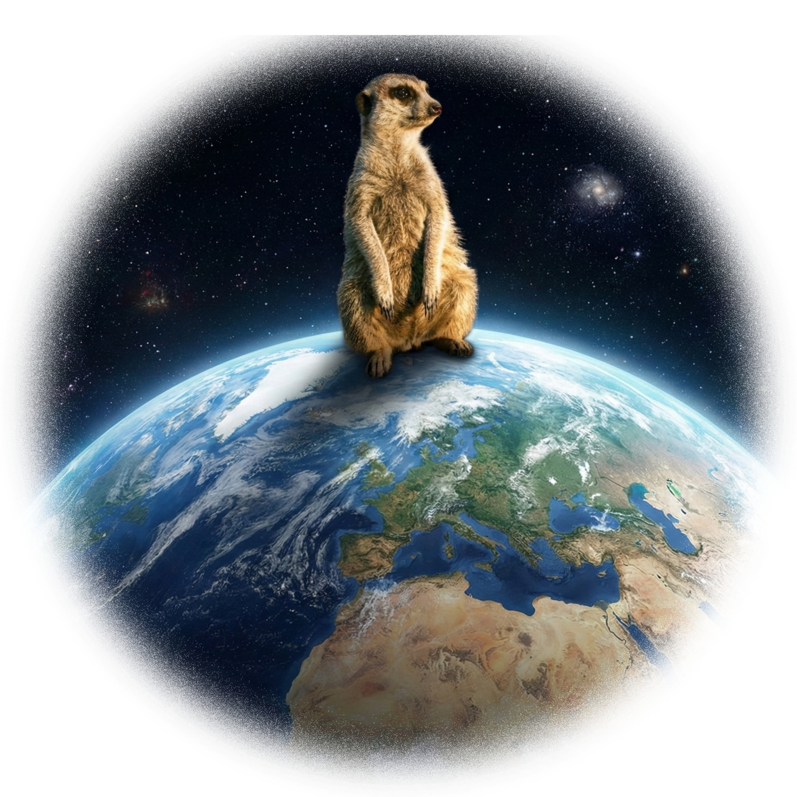
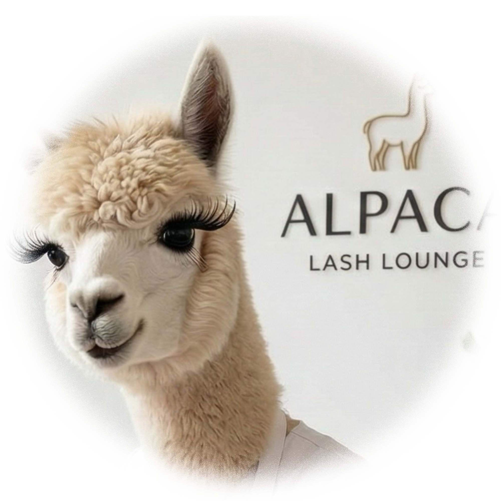
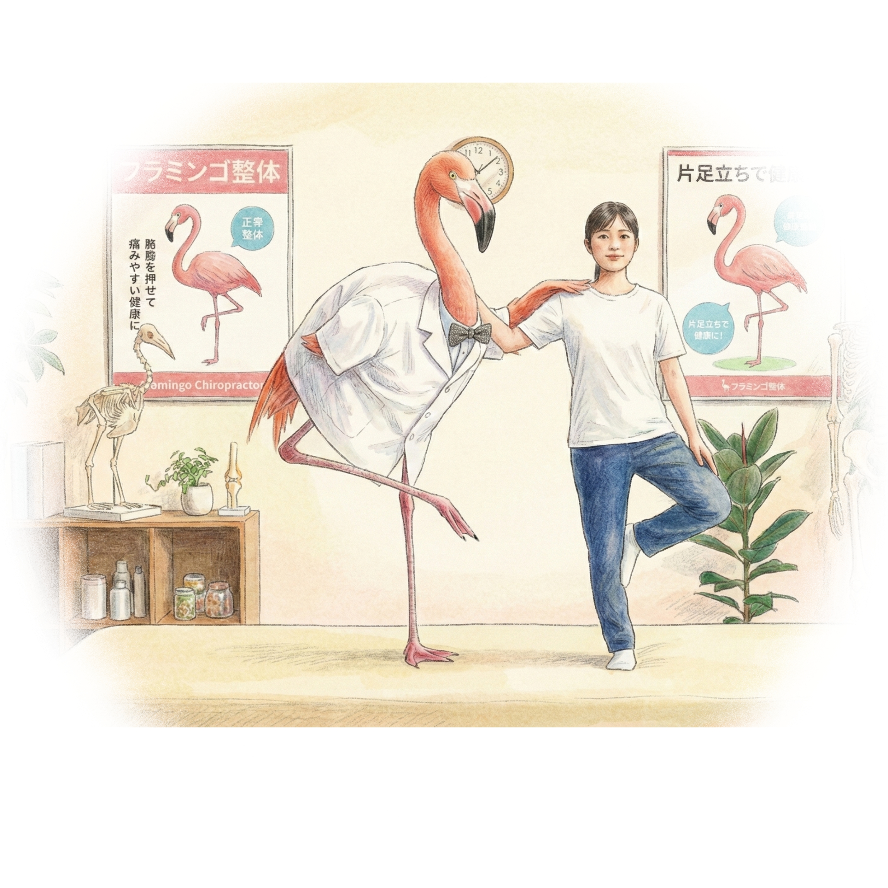
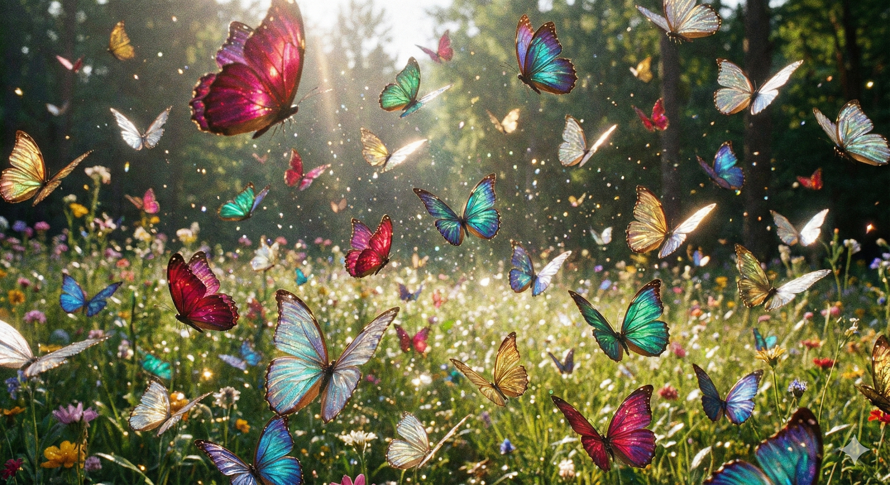

# 🤖 My LINE Bots Collection (どうぶつAIボット集)

Python と Google Gemini API を活用した、多機能なLINEボットたちのコード集です。
それぞれのボットが異なる個性と機能を持っています。

## 🐾 ボット一覧 (Bot List)

| アイコン | 名前 | 機能 | ファイル&nbsp;&nbsp;&nbsp;&nbsp;&nbsp;&nbsp;&nbsp;&nbsp;&nbsp;&nbsp; |
| :---: | :--- | :--- | :--- |
|  | **キツネくんの動画要約🦊** (Fox YouTube)  | **YouTube動画要約 & 検索** 動画の内容をAIが解説し、Google検索で補足情報を教えてくれます。 | [🐍 Python](fox.py) [📜 説明書](fox.md) [📘 Zenn](https://zenn.dev/miki_mini/articles/9226ee797b59a1) |
|  | **☀️カエルくんのお天気予報🐸** (Weather Frog)  | **天気予報 & Googleマップ** 毎朝のお天気と服装情報通知＋位置情報から天気や周辺情報を教えてくれます。 | [🐍 Python](frog.py) [📜 説明書](frog.md)  [🚀 GAS](gas/frog_morning.js) [📘 Zenn](https://zenn.dev/miki_mini/articles/baaa626bebbc34) |
|  | **スーパー秘書ペンギン🐧** (Secretary Penguin)  | **メール送信代行 ＆ 接待コンシェルジュ** 宛先と本文を送るとメールを代行送信します。接待のお店や手土産選びの相談も可能です。 | [🐍 Python](penguin.py)  [📜 説明書](penguin.md)  [🚀 GAS](gas/mail_sender.gs) [📘 Zenn](https://zenn.dev/miki_mini/articles/91f37ee46a1df7) |
|  | **月うさぎからのおくりもの🐇🌝** (Moon Rabbit)  | **生活習慣記録 & 育成** 「おはよう」でポイントが貯まる育成ゲーム機能付き。 | [🐰 GitHub](https://github.com/miki-mini/moon-rabbit) [📘 Zenn](https://zenn.dev/miki_mini/articles/451bc4123fe3dc) |
|  | **まめなビーバーメモ🦫** (Beaver Memo)  | **リマインダー & 予定抽出** 決まった時間の通知や、画像から予定を読み取って通知します。 | [🐍 Python](beaver.py) [📜 説明書](beaver.md)  [🚀 GAS](gas/beaver.gs) [📘 Zenn](https://zenn.dev/miki_mini/articles/7b86afc4f9c390) |
|  | **AIトピックのカピバラ解説** (Capybara News)  | **AIニュース要約 & 検索** ニュース要約に加え、Google検索で最新情報を教えてくれます。 | [🐍 Python](capybara.py) [📜 説明書](capybara.md) [📘 Zenn](https://zenn.dev/miki_mini/articles/0a5e3af5d476c2) |
|  | **フクロウ教授画像生成🦉** (Professor Owl)  | **画像生成 & 健康管理** 画像生成や、カロリー計算・体重管理のグラフ化を行います。 | [🐍 Python](owl.py) [📜 説明書](owl.md)  [🚀 GAS](gas/owl.gs) [📘 Zenn](https://zenn.dev/miki_mini/articles/fbfec817389ea2) |
|  | **🤖おしゃべりVoidollねこ🐱** (Chat Voidoll)  | **音声会話** テキストだけでなく、音声での自然な会話が楽しめます。 | [🐍 Python](voidoll.py) [📜 説明書](voidoll.md) [📘 Zenn](https://zenn.dev/miki_mini/articles/fca9c087522f71) |
|  | **もぐら駅長🦡** (Station Master Mole)  | **時刻表 & 駅検索** 駅名の時刻表や、Googleマップでの場所案内をします。 | [🐍 Python](mole.py) [📜 説明書](mole.md) [📘 Zenn](https://zenn.dev/miki_mini/articles/fb9c9485664daf) |
|  | **星くじらからの光の便り🐋💫** (Star Whale)  | **天体観測 & 宇宙旅行** NASAの美丽な写真や、ISSの位置・火星の風景を届けます。 | [🐍 Python](whale.py) [📜 説明書](whale.md) [📘 Zenn](https://zenn.dev/miki_mini/articles/9ea3f0a17c4606) |
|  | **コウモリの番組お知らせ🦇** (TV Bat)  | **TV番組検索 & 通知** 「ジブリやる？」で検索。見たい番組を登録すると自動で通知します。スクレイピング不使用。 | [🐍 Python](bat.py) [📜 説明書](bat.md) [📘 Zenn](https://zenn.dev/miki_mini/articles/a70b65b67b5c93) |
|  | **ミーアキャットの地震警備🦦** (Meerkat Quake)  | **地震速報 & サイト死活監視** 震度3以上の地震をLINE通知。登録サイトの異常も監視します。 | [🦦 GitHub](https://github.com/miki-mini/meerkat-quake) [📘 Zenn](https://zenn.dev/miki_mini/articles/4cb43007f402a1) |
|  | **アルパカのまつエクサロン🦙** (Alpaca Salon)  | **まつエク試着シミュレーション** カメラで撮影した顔に、まつエクを重ねて仕上がりをイメージできます。 | [🔍 HTML](../static/alpaca.html) [📜 説明書](alpaca.md) [📘 Zenn](https://zenn.dev/miki_mini/articles/1bbf185039e498) |
|  | **姿勢のフラミンゴ先生** (Flamingo Sensei)  | **姿勢矯正 & バランスゲーム** カメラで姿勢の歪みをチェック。完全無料でプライバシーも安全です。 | [🔍 HTML](../static/flamingo.html) [📜 説明書](flamingo.md) [📘 Zenn](https://zenn.dev/miki_mini/articles/b316596a39a59c) |
|  | **美の蝶々パーソナル🦋** (Butterfly Checko)  | **パーソナルカラー & 顔タイプ診断** AIが似合う色と髪型を診断。※骨格診断はフラミンゴへ移動しました。 | [🔍 HTML](../static/butterfly.html) [📜 説明書](butterfly.md) [📘 Zenn](https://zenn.dev/miki_mini/articles/8aa118abc591e8) |
|  | **リスのほっぺたどんぐりゲーム🐿️** (Squirrel Game)  | **対戦アクションゲーム** カメラで手を認識し、落ちてくるどんぐりをキャッチしてほっぺたを膨らませる2人対戦ゲーム。 | [🔍 HTML](../static/squirrel.html) [📜 説明書](squirrel.md) [📘 Zenn](https://zenn.dev/miki_mini/articles/66ad9e4a3073af) |
|  | **カラフルお魚のお部屋水族館🐠** (Fish Room Aquarium)  | **バーチャル水族館** 手で魚と触れ合える癒やしの空間。サメやタコも登場します。 | [🔍 HTML](../static/fish.html) [📜 説明書](fish.md) |

## 🛠 全体で使用している技術

* **言語**: Python 3.10+
* **AI**: Google Gemini 2.5 Pro / Flash
* **基盤**: Google Cloud Run / FastAPI
* **PF**: LINE Messaging API

---
Developed by miki-mini