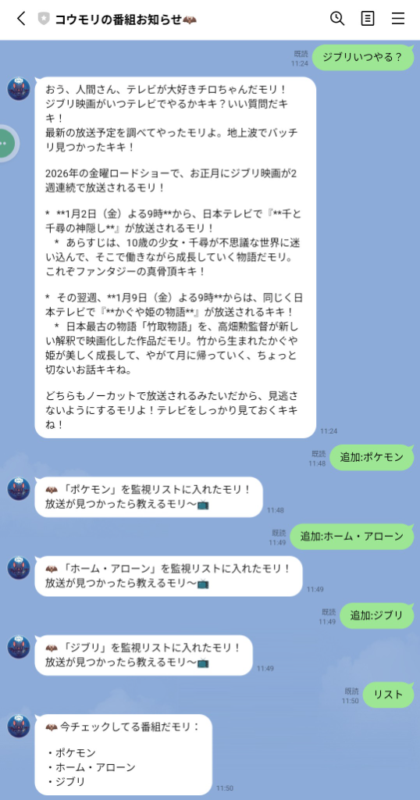
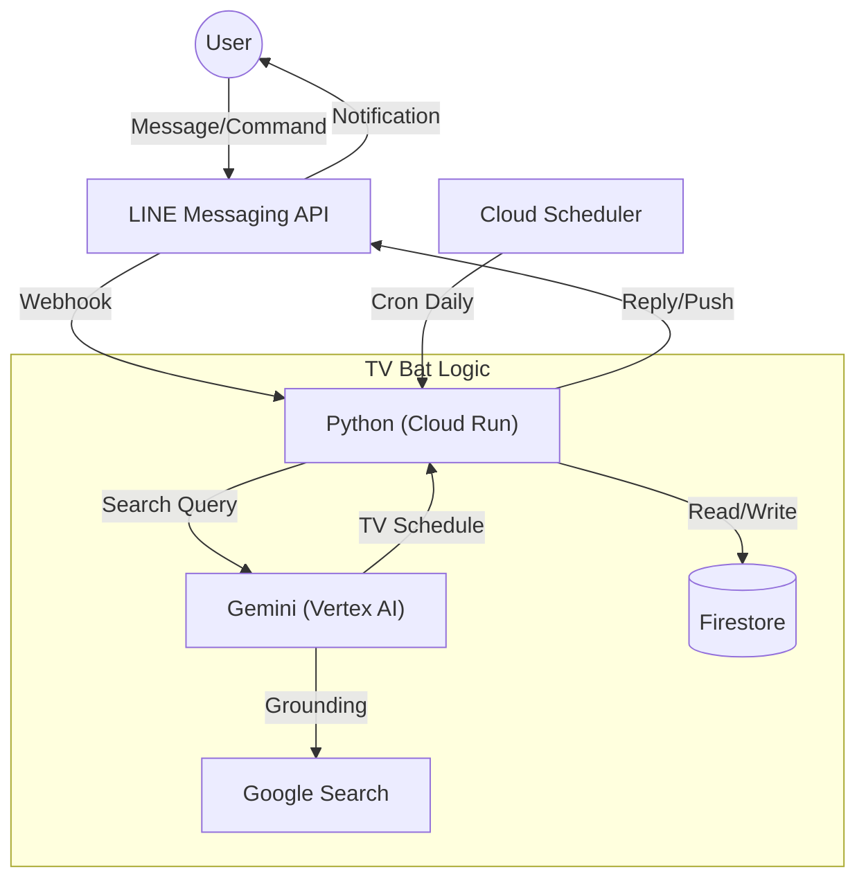

# コウモリの番組お知らせ🦇 - TV番組表通知ボット / TV Bat


スクレイピングを行わず、**Gemini (Vertex AI) の検索機能** を使ってテレビ番組をチェックするボットです。
ユーザーが指定したキーワード（例：「ジブリ」「ホーム・アローン」）の放送予定が見つかると、自動で通知します。

---

## 🛠 機能詳細 (Features)

### 📺 1. TV番組検索 (On-Demand Search)
*   **「ジブリやる？」** **「来週の金曜ロードショーは？」** と話しかけると、その場で検索して教えてくれます。
*   GeminiがリアルタイムでGoogle検索を行い、地上波の情報を優先して回答します。

### 📝 2. 見たい番組リスト管理 (Watch List)
Firestoreを使って、監視したい番組を自由に登録できます。

*   **「追加: ポケモン」** : 監視リストに追加
*   **「削除: ポケモン」** : 監視リストから削除
*   **「リスト」** : 現在登録しているキーワードを確認

### 🕒 3. 自動通知 (Cron Notification)
*   外部から `/cron/bat_check` にアクセスすることで、登録リストの番組を一括チェック。
*   放送予定が **今日（当日）** 見つかった場合のみ、LINEで通知を送ります。
    *   *※現在は簡易実装として、見つかった場合は全員に通知（Broadcast）します。*



---

## 🏗 技術的な仕組み (Technical Mechanism)

通常の番組表API（有料）やスクレイピング（不安定）を使わず、**LLMの検索能力** に依存する構成です。



1.  **Search**: GeminiのGrounding (Google Search) 機能を利用。
2.  **Persistence**: ユーザーごとの監視キーワードは **Firestore** に保存。
3.  **Check Logic**:
    *   Geminiに「来週のテレビで『○○』の放送はある？」と検索させる。
    *   **「ある」と断定できた場合のみ** テキストを生成させ、ハルシネーション（嘘の通知）を防ぐプロンプト設計。

---

## 🔧 設定 (Configuration)

### 必要な環境変数 (.env)
```
BAT_ACCESS_TOKEN=...
BAT_CHANNEL_SECRET=...
```

### Cron設定 (例: Cloud Scheduler)
毎日朝8時にチェックする場合：
*   **URL**: `https://YOUR-CLOUD-RUN-URL/cron/bat_check`
*   **Method**: GET
*   **Frequency**: `0 8 * * *`

---

## 📢 キャラクター設定
*   名前：チロちゃん（テレビコウモリ）
*   性格：夜行性でテレビっ子。少し毒舌だが親切。
*   語尾：「〜モリ」「〜キキ」

---

Developed by miki-mini Antigravity
