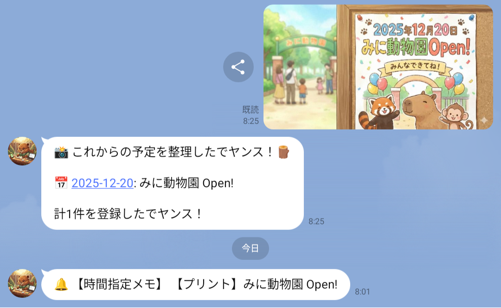
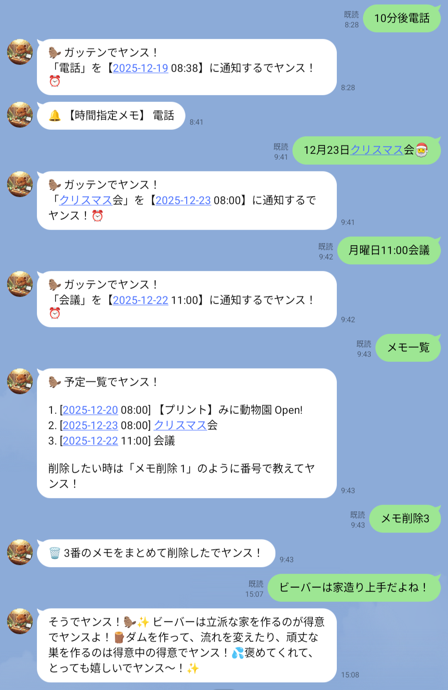
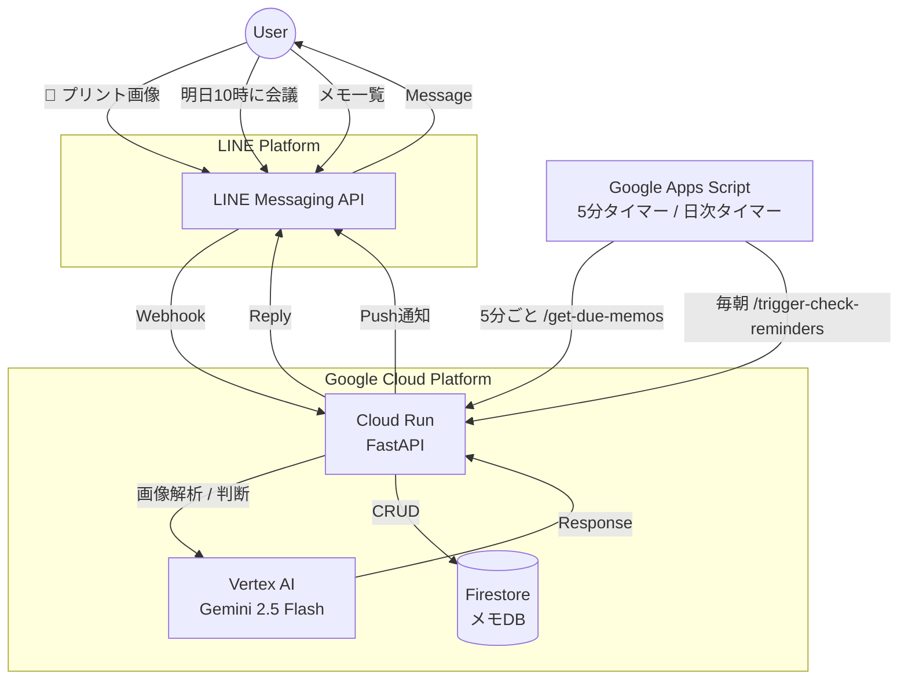

# 🦫 まめなビーバー - メモ＆リマインダーBot (Beaver Memo & Reminder Bot)

学校のプリントや日々の予定を、AIが自動で整理してくれる「まめなビーバー」です。
写真を撮るだけでスケジュールを抽出し、時間になったらLINEでお知らせ。忙しい毎日をサポートします。

---

## 🚀 主な機能 (Features)

### 1. 📸 プリント画像からの予定抽出
* 学校のおたよりや地域のチラシを**写真で送るだけ**で、AIが自動で予定を読み取ります。
* 「運動会」「提出期限」「保護者会」などの重要イベントを抽出し、Firestoreに自動登録します。
* 過去の日付や印刷日などの事務的な日付は自動で除外します。

### 2. 🧠 AI自動判断（メモ or 雑談）
* ユーザーのメッセージを**AIが自動で判断**します。
* 「明日10時に会議」→ 予定として登録 ✅
* 「12月23日クリスマス会」→ **朝8:00**に予定登録 🕗 (new!)
* 「こんにちは」→ 雑談として応答 💬
* 「5分後にゴミ出し」→ 時間を計算して通知設定 ⏰

### 3. ⏰ リマインダー通知（GAS連携）
* **5分ごと**に期限をチェックし、時間になったらLINEでプッシュ通知を送ります。
* **毎朝**、今日・明日の予定をまとめて通知します。
* 時間指定のないメモは、**日次要約**としてリスト化してお届けします。

### 4. 📝 メモ一覧＆削除
* 「メモ一覧」と送ると、登録した予定を番号付きで表示します。
* 「メモ削除 1 3」のように番号を指定して、まとめて削除できます。

---

## 📱 画面イメージ（Screenshots）

| 架空の動物園POP | メモ一覧＆削除・リマインダー通知 |
| :---: | :---: |
|     |  |
| 写真を送るだけで自動登録 時間になったらプッシュ通知| 番号指定で削除 メモか雑談かを自動判別|

---

## 🛠 技術スタック (Tech Stack)

* **Language:** Python 3.10+
* **Framework:** FastAPI
* **AI Model:** Google Gemini 2.5 Flash (テキスト & Vision)
* **Database:** Google Cloud Firestore
* **Platform:** Google Cloud Run
* **Interface:** LINE Messaging API (Webhook + Push)
* **Scheduler:** Google Apps Script (GAS)

---

## 🏗 アーキテクチャ (Architecture)

---

## 📡 API エンドポイント (GAS連携用)

GASから呼び出されるバックエンド機能です。

| エンドポイント | メソッド | 説明 |
|---------------|---------|------|
| `/callback/beaver` | POST | LINE Webhook |
| `/add-memo` | POST | メモ追加 |
| `/get-memos/{user_id}` | GET | メモ一覧取得 |
| `/delete-memo/{memo_id}` | DELETE | メモ削除 |
| `/get-due-memos` | GET | 期限到来メモ取得（5分タイマー用） |
| `/get-daily-summary-memos` | GET | 日次要約メモ取得 |
| `/trigger-check-reminders` | GET | 今日・明日の予定通知 |

---

## ⚠️ GASのセキュリティ設定 (GitHub公開時の注意)

このプロジェクトでは **Google Apps Script (GAS)** を使用していますが、GitHubにコードを公開する際は、**APIキーやトークンを直接コードに書かない**ように注意してください。

### ✅ 安全な設定方法 (推奨)

1.  GASのエディタを開く
2.  左側の歯車アイコン（プロジェクトの設定）をクリック
3.  **「スクリプトプロパティ」** を一番下までスクロールして見つける
4.  「スクリプトプロパティを追加」をクリックして、以下のキーと値を設定する

| プロパティ名 | 設定する値 |
| :--- | :--- |
| `LINE_ACCESS_TOKEN` | LINE Developersで取得したアクセストークン |
| `PYTHON_SERVER_URL` | Cloud RunのベースURL (例: `https://xxxx.a.run.app`) |
| `GEMINI_API_KEY` | (予備) Gemini APIキー |

コード内では `PropertiesService.getScriptProperties().getProperty('KEY_NAME')` を使って読み込むように実装されています。

---

## 📜 開発・進化の歴史 (Development History)

*   **初期 (Phase 1):** Pythonのノートブック上で動くシンプルなプログラムとして試作。
*   **現在 (Phase 2):** クラウドデータベース (**Google Cloud Firestore**) を導入。
    *   これにより、プログラムが再起動してもメモが消えなくなりました。
    *   また、複数のユーザーが同時に使ってもデータが混ざらないようになりました。

---

## 🦫 キャラクター設定

* **名前:** まめなビーバー
* **性格:** 几帳面でマメ、働き者
* **口癖:** 「〜でヤンス」「ガッテンでヤンス！」
* **特技:** スケジュール管理、コツコツ作業
* **好きなもの:** 丸太、ダム作り、整理整頓

---

Developed by miki-mini