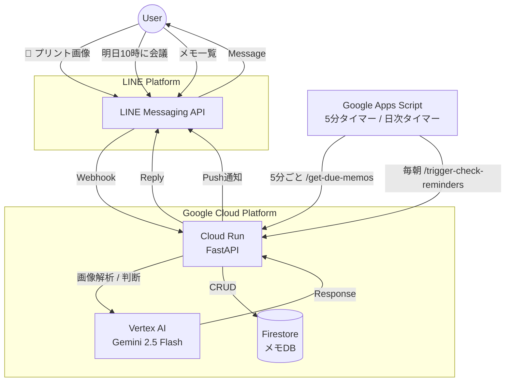

# 🦫 まめなビーバー - メモ＆リマインダーBot (Beaver Memo & Reminder Bot)


学校のプリントや日々の予定を、AIが自動で整理してくれる「まめなビーバー」です。
写真を撮るだけでスケジュールを抽出し、時間になったらLINEでお知らせ。忙しい毎日をサポートします。

---

## 🚀 主な機能

### 1. 📸 プリント画像からの予定抽出
* 学校のおたよりや地域のチラシを**写真で送るだけ**で、AIが自動で予定を読み取ります。
* 「運動会」「提出期限」「保護者会」などの重要イベントを抽出し、Firestoreに自動登録します。
* 過去の日付や印刷日などの事務的な日付は自動で除外します。

### 2. 🧠 AI自動判断（メモ or 雑談）
* ユーザーのメッセージを**AIが自動で判断**します。
* 「明日10時に会議」→ 予定として登録 ✅
* 「こんにちは」→ 雑談として応答 💬
* 「5分後にゴミ出し」→ 時間を計算して通知設定 ⏰

### 3. ⏰ リマインダー通知（GAS連携）
* **5分ごと**に期限をチェックし、時間になったらLINEでプッシュ通知を送ります。
* **毎朝**、今日・明日の予定をまとめて通知します。
* 時間指定のないメモは、**日次要約**としてリスト化してお届けします。

### 4. 📝 メモ一覧＆削除
* 「メモ一覧」と送ると、登録した予定を番号付きで表示します。
* 「メモ削除 1 3」のように番号を指定して、まとめて削除できます。

---

## 📱 画面イメージ（Screenshots）

| プリント画像から予定抽出 | メモ一覧＆削除 |
| :---: | :---: |
|  |  |
| 写真を送るだけで自動登録 | 番号指定でまとめて削除 |

| AI自動判断 | リマインダー通知 |
| :---: | :---: |
|  |  |
| メモか雑談かを自動判別 | 時間になったらプッシュ通知 |

---

## 🛠 技術スタック (Tech Stack)

* **Language:** Python 3.10+
* **Framework:** FastAPI
* **AI Model:** Google Gemini 2.5 Flash (テキスト & Vision)
* **Database:** Google Cloud Firestore
* **Platform:** Google Cloud Run
* **Interface:** LINE Messaging API (Webhook + Push)
* **Scheduler:** Google Apps Script (GAS)

---

## 🏗 アーキテクチャ (Architecture)


```mermaid
graph TD
    User((User))
    GAS[Google Apps Script<br/>5分タイマー / 日次タイマー]

    subgraph LINE Platform
        L_API[LINE Messaging API]
    end

    subgraph Google Cloud Platform
        CR[Cloud Run<br/>FastAPI]
        Gemini[Vertex AI<br/>Gemini 2.5 Flash]
        FS[(Firestore<br/>メモDB)]
    end

    %% ユーザーからのメッセージ
    User -- "📸 プリント画像" --> L_API
    User -- "明日10時に会議" --> L_API
    User -- "メモ一覧" --> L_API
    L_API -- Webhook --> CR

    %% AI処理
    CR -- "画像解析 / 判断" --> Gemini
    Gemini -- Response --> CR

    %% DB操作
    CR -- "CRUD" --> FS

    %% 返信
    CR -- Reply --> L_API
    L_API -- Message --> User

    %% GASからの定期実行
    GAS -- "5分ごと /get-due-memos" --> CR
    GAS -- "毎朝 /trigger-check-reminders" --> CR
    CR -- "Push通知" --> L_API
```

---

## 📡 API エンドポイント (GAS連携用)

| エンドポイント | メソッド | 説明 |
|---------------|---------|------|
| `/callback/beaver` | POST | LINE Webhook |
| `/add-memo` | POST | メモ追加 |
| `/get-memos/{user_id}` | GET | メモ一覧取得 |
| `/delete-memo/{memo_id}` | DELETE | メモ削除 |
| `/get-due-memos` | GET | 期限到来メモ取得（5分タイマー用） |
| `/get-daily-summary-memos` | GET | 日次要約メモ取得 |
| `/trigger-check-reminders` | GET | 今日・明日の予定通知 |

---

## 🦫 キャラクター設定

* **名前:** まめなビーバー
* **性格:** 几帳面でマメ、働き者
* **口癖:** 「〜でヤンス」「ガッテンでヤンス！」
* **特技:** スケジュール管理、コツコツ作業
* **好きなもの:** 丸太、ダム作り、整理整頓

---

## 🔧 環境変数

```env
BEAVER_ACCESS_TOKEN=your_line_access_token
BEAVER_CHANNEL_SECRET=your_line_channel_secret
GCP_PROJECT_ID=your_gcp_project_id
GEMINI_API_KEY=your_gemini_api_key
```

---

Developed by miki-mini