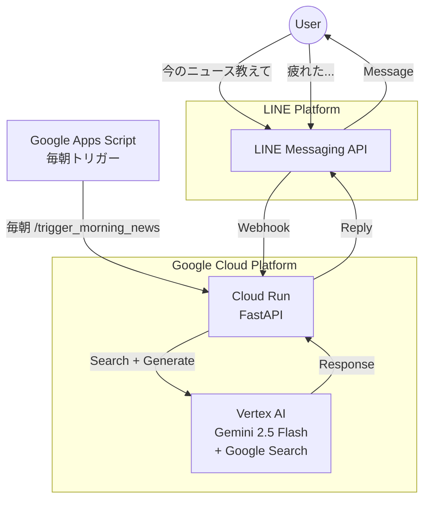

# 🐹 カピバラニュース解説 & 癒やしボット (Capybara News & Healing Bot)

毎日の難しいニュースを、Google検索を活用してカピバラさんが「っぴ」語尾で優しく解説してくれるAIボットです。
さらに、ユーザーが「疲れた」とこぼすと、自動で**「温泉モード♨️」**に切り替わり、ニュースではなく動物の雑学や優しい言葉で癒やしてくれます。

---

## 🚀 主な機能

### 1. 📰 AIニュース解説（Google検索搭載）
* 「今日のAIニュースを教えて」「昨日の株価は？」などと聞くと、**Google検索機能（Grounding）**を使って最新情報を収集します。
* 難しい専門用語も、カピバラのキャラクター（語尾：っぴ）で、初心者にも分かりやすく噛み砕いて説明します。

### 2. ♨️ 温泉モード（癒やし機能）
* ユーザーの**「疲れた」「休憩」「しんどい」**といったキーワードを自動検知します。
* このモードではニュース検索を行わず、**「心温まる動物雑学」**や**「労いの言葉」**をかけて、あなたを全力で癒やします。柚子湯に入っているようなリラックス感を提供します。

### 3. ☀️ 朝のニュース配信（Broadcast）
* 毎朝決まった時間に、その日の注目ニュースを3つピックアップしてLINEに配信します（トリガー実行）。
* 「今日も一日がんばるっぴ！🍊」と、一日の始まりを元気にサポートします。

---

## 📱 画面イメージ（Screenshots）

| 最新情報を検索＆解説 | 温泉モード（癒やし） |
| :---: | :---: |
|  |  |
| Google検索結果を要約 | 「疲れた」に反応して癒やし会話 |

---

## 🛠 技術スタック (Tech Stack)

* **Language:** Python 3.10+
* **Framework:** FastAPI
* **AI Model:** Google Gemini 2.5 Flash
* **Search:** Google GenAI SDK (google-genai) with Google Search
* **Platform:** Google Cloud Run
* **Interface:** LINE Messaging API (Webhook)
* **Scheduler:** Google Apps Script (GAS)

---

## 🏗 アーキテクチャ (Architecture)

---
Developed by miki-mini