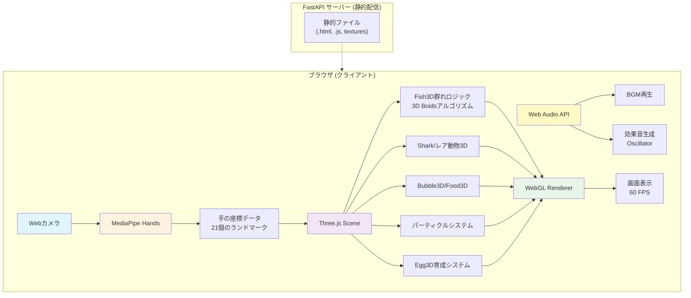

# 🐠 Digital Art Aquarium 3D - おうちデジタル水族館 3D


Webカメラとブラウザだけで遊べる、**3D空間のインタラクティブ水族館アート**アプリです。
デジタルアートミュージアムのような体験型アートに憧れて作りました！

**🎉 NEW!** 2D版から3D版へ大幅パワーアップ！
- 奥行きのある3D空間で魚が泳ぐ
- ピンチジェスチャーでエサやり
- たまごを温めて孵化させる育成要素

プロジェクターで天井に投影すれば、病院のベッドでも遊べます。
入院されている方にも楽しんでいただけることを願っています。

## ✨ Features

### 🆕 3D版の新機能

- 🌊 **3D空間**: Three.jsで実現した奥行きのある水中世界
- 🍞 **エサやり**: 親指と人差し指をつまむとエサが落ちる
- 🥚 **育成システム**: たまごを手で温めて孵化、エサで魚が成長
- 💧 **水面の波紋**: 手を素早く動かすと波紋エフェクト
- ✨ **魔法の手**: ゆっくり動かすとキラキラパーティクル
- ⚡ **クラゲ**: 触ると電気ショックエフェクト

### 継続機能

- 🐟 **リアルな魚の群れ**: Boidsアルゴリズムで3D空間を自然に泳ぐ（80匹）
- ✋ **手で誘導**: MediaPipeで手を認識、魚を自由に誘導
- 🦈 **サメ登場**: 定期的に現れるサメを手で追い払う
- 🐙🐢 **レア動物**: タコやカメが出現、触ると特別なエフェクト
- 🫧 **バブル**: 上昇する泡を手で割って遊べる
- 🎵 **BGM・効果音**: Web Audio APIで臨場感のある音響
- 📱 **ブラウザのみ**: インストール不要、Webカメラがあればすぐ遊べる

## 💡 Use Cases

このアプリは様々なシーンで活用できます：

- 👶 **子供の遊び場**: 家庭で楽しめるインタラクティブアート
- 🏥 **医療施設**: プロジェクターで天井に投影すれば、ベッドに横になったままでも遊べます
- 🎓 **教育現場**: プログラミング教育やインタラクティブアートの教材として
- 🎪 **イベント**: デジタルアート展示やワークショップで
- 🧘 **リハビリ**: 手の運動やリハビリテーションに

| プロジェクターで投影すれば、大画面でプレイが楽しめます🐟 | スマホでもできます📱 |
|:--------:|:--------:|
|  |  |

## 🎯 How to Play

### 基本操作

1. **カメラを許可**: ブラウザでカメラへのアクセスを許可してください
2. **手を動かす**: 人差し指を動かすと魚が寄ってきます
3. **サメを追い払う**: サメが現れたら手を素早く振って追い払いましょう
4. **バブルを割る**: 上昇する泡を指で弾いて割りましょう

### 🆕 新しい遊び方

5. **エサやり**: 親指と人差し指をつまむ（ピンチ）とエサが落ちます。魚がエサを食べると成長！
6. **たまごを温める**: 上から降ってくるたまごに手をかざして温めると、ハートが出て赤ちゃん魚が生まれます
7. **レア動物を探す**:
   - 🐢 カメに触ると回転してキラキラ
   - 🐙 タコに触るとスミを吐く
   - 🎐 クラゲに触ると電気ショック
8. **水面を揺らす**: 手を素早く動かすと波紋が広がります

## 🚀 Getting Started

### Prerequisites

- モダンなWebブラウザ (Chrome, Firefox, Safari等)
- Webカメラ
- Node.js (開発時のみ必要)

### Installation

```bash
# リポジトリをクローン
git clone https://github.com/your-username/fish-aquarium.git

cd fish-aquarium

# 依存パッケージをインストール
npm install

# 開発サーバーを起動
npm start
```

ブラウザで `http://localhost:8080` を開いてください。

### Static Hosting

静的ファイルなので、そのままホスティングサービスで公開できます。

```bash
# ビルド (必要に応じて)
npm run build

# publicフォルダをホスティングサービスにデプロイ
```

対応サービス:
- Netlify
- Vercel
- GitHub Pages
- Firebase Hosting
- Google Cloud Run

## 🛠️ Tech Stack

### Core Technologies

- **Three.js (r128)** - 3D空間のレンダリング
- **MediaPipe Hands** - 手の検出・トラッキング
- **WebGL** - Three.jsを通じた高速描画
- **Web Audio API** - BGM・効果音の生成
- **Vanilla JavaScript** - フレームワーク不要のシンプル設計

### Version Comparison

| Feature | 2D版 | 3D版 |
|---------|------|------|
| 描画エンジン | Canvas 2D API | Three.js (WebGL) |
| 魚の数 | 60匹 | 80匹 |
| 空間 | 平面 | 立体（奥行き） |
| インタラクション | タッチのみ | ジェスチャー認識 |
| 育成要素 | なし | たまご孵化・成長 |
| エフェクト | シンプル | リッチ（パーティクル） |

## 🏗️ Architecture



### Data Flow

1. **Input**: Web camera → MediaPipe Hands
2. **Gesture Recognition**: Pinch detection, hand speed tracking
3. **3D Physics**: Boids algorithm in 3D space, food seeking, growth logic
4. **Rendering**: Three.js WebGL renderer at 50-60 FPS
5. **Audio**: Web Audio API generates sound effects dynamically

### Key Features

- **3D Space**: 1200x800x800 world with depth
- **Real-time Physics**: 80 fish with Boids flocking in 3D
- **Gesture Control**: Pinch for food, hand warmth for eggs
- **Particle Effects**: Sparkles, hearts, lightning, ink
- **Growth System**: Fish eat food and grow larger

## 📂 Project Structure

```
fish-aquarium/
├── static/
│   ├── fish.html           # 2D版HTML
│   ├── fish-3d.html        # 🆕 3D版HTML
│   └── images/
│       └── fish/
│           ├── shark.png           # サメ画像
│           ├── turtle.png          # カメ画像
│           ├── turtle.kirakira.png # カメ（キラキラ）
│           ├── octopus.png         # タコ画像
│           ├── octopus.sumi.png    # スミエフェクト
│           ├── jellyfish.png       # 🆕 クラゲ画像
│           └── fish.mp3            # BGM
├── animals/                # 動物のロジック（FastAPI側）
├── main.py                 # FastAPIサーバー
├── requirements.txt
└── README.md
```

## 🔧 Implementation Details

### 3D Boids Algorithm

魚の群れの動きを3D空間に拡張：

```javascript
class Vector3D {
    constructor(x, y, z) {
        this.x = x; this.y = y; this.z = z;
    }
    // 3D vector operations
}

class Fish3D {
    flock(boids) {
        let sep = this.separate(boids);   // 分離
        let ali = this.align(boids);      // 整列
        let coh = this.cohesion(boids);   // 結束

        // エサへの誘導
        let foodForce = this.seekFood(foods);

        this.applyForce(sep);
        this.applyForce(ali);
        this.applyForce(coh);
        this.applyForce(foodForce);
    }
}
```

### Gesture Recognition

| ジェスチャー | 検出方法 | 効果 |
|------------|---------|------|
| ピンチ | 親指と人差し指の距離 < 0.05 | エサ投下 |
| 素早く動かす | 手の速度 > 20px/frame | 波紋生成 |
| 手をかざす | 画面座標での重なり判定 | たまご孵化 |
| ゆっくり動かす | 手の速度 < 15px/frame | キラキラ |

### Growth System

```javascript
class Fish3D {
    seekFood(foods) {
        // エサを探す
        if (closest && minDist < 20) {
            closest.eaten = true;
            this.currentSize += 2.0; // 成長
            this.updateSize();
        }
    }
}

class Egg3D {
    checkWarmth(handPos) {
        if (overlap) {
            this.incubation += 1; // 温もり蓄積
            if (this.incubation > 60) {
                this.hatch(); // 孵化
            }
        }
    }
}
```

### Particle System

テクスチャを使ったリッチなエフェクト：

```javascript
class ParticleSystem {
    constructor(x, y, z, type) {
        // type: 'sparkle', 'heart', 'shock', 'ink'
        const material = new THREE.PointsMaterial({
            map: texture,
            blending: THREE.AdditiveBlending,
            transparent: true
        });
    }
}
```

## ⚡ Performance Optimization

### 3D Space Optimizations

- **Fog**: 遠くのオブジェクトをフェードアウト
- **Screen Space Collision**: 3D→2D投影で軽量化
- **Object Disposal**: 不要なメッシュは即座に削除
- **Distance-based Updates**: 近傍探索の最適化

### Performance Metrics

| 項目 | 2D版 | 3D版 |
|------|------|------|
| FPS | 55-60 | 50-60 |
| 魚の数 | 60匹 | 80匹 |
| エフェクト | シンプル | リッチ |
| メモリ使用量 | ~150MB | ~250MB |
| 描画方式 | Canvas 2D | WebGL |

## 🐛 Known Issues

- [ ] 照明が暗いと手の認識精度が下がる
- [ ] 古いデバイスでは処理負荷が高い場合がある
- [ ] Safariでの一部エフェクトの互換性

## 🚨 Important Notes

### File Naming Convention

⚠️ **ファイル名は必ず英数字のみを使用してください！**

日本語のファイル名はコンテナビルド時にエラーを引き起こします。

```bash
# ❌ Bad
魚の音.mp3
波の音.mp3

# ✅ Good
fish_sound.mp3
wave_sound.mp3
```

### Browser Compatibility

| Browser | 2D版 | 3D版 |
|---------|------|------|
| Chrome | ✅ | ✅ |
| Firefox | ✅ | ✅ |
| Safari | ✅ | ⚠️ (一部制限) |
| Edge | ✅ | ✅ |
| Mobile Safari | ✅ | ⚠️ (性能制限) |
| Mobile Chrome | ✅ | ✅ |

## 🔮 Future Enhancements

### Technical Improvements

- [ ] **オブジェクトプーリング**: メッシュの生成・破棄を削減
- [ ] **LOD (Level of Detail)**: 遠くの魚は低ポリゴンに
- [ ] **Custom Shaders**: より美しい水の表現
- [ ] **VR Support**: WebXRで没入感向上

### Feature Additions

- [ ] **マルチプレイヤー**: WebRTCで複数人同時プレイ
- [ ] **魚の種類追加**: イルカ、マンタ、エイなど
- [ ] **水槽カスタマイズ**: 背景や装飾を変更
- [ ] **成長グラフ**: 魚のサイズ履歴を可視化
- [ ] **スコアシステム**: ゲーム要素の追加

### Social Impact

- [ ] 病院への導入事例を作る
- [ ] 教育機関での活用
- [ ] 介護施設でのリハビリ活用

## 📖 Documentation

詳しい技術解説は以下の記事をご覧ください：

- [2D版の解説記事](https://zenn.dev/miki_mini/articles/214983f7aedad5) - Boidsアルゴリズムやパフォーマンス最適化
- [3D版の解説記事](#) - Three.js実装、ジェスチャー認識、育成システム

## 🤝 Contributing

プルリクエストを歓迎します！大きな変更の場合は、まずissueを開いて変更内容を議論してください。

1. このリポジトリをフォーク
2. 機能ブランチを作成 (`git checkout -b feature/amazing-feature`)
3. 変更をコミット (`git commit -m 'Add amazing feature'`)
4. ブランチにプッシュ (`git push origin feature/amazing-feature`)
5. プルリクエストを開く

## 📝 License

このプロジェクトは MIT License の下でライセンスされています。
詳細は [LICENSE](LICENSE) ファイルを参照してください。

## 🙏 Acknowledgments

- [MediaPipe](https://google.github.io/mediapipe/) - 手の認識
- [Three.js](https://threejs.org/) - 3Dレンダリング
- [Boids Algorithm](https://en.wikipedia.org/wiki/Boids) - Craig Reynolds
- 体験型デジタルアート - インスピレーション


🐟 Happy Fishing! 🐠