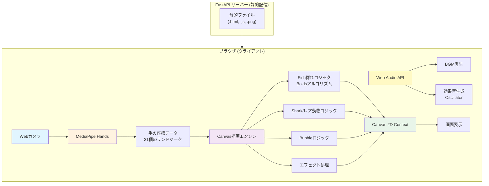

# 🐠 Digital Art Aquarium - おうちデジタル水族館


Webカメラとブラウザだけで遊べる、インタラクティブな水族館アートアプリです。
デジタルアートミュージアムのような体験型アートに憧れて作りました！

プロジェクターで天井に投影すれば、病院のベッドでも遊べます。
入院されている方にも楽しんでいただけることを願っています。


## ✨ Features

- 🐟 **リアルな魚の群れ**: Boidsアルゴリズムで自然な動きを再現
- ✋ **手で誘導**: MediaPipeで手を認識、魚を自由に誘導
- 🦈 **サメ登場**: 定期的に現れるサメを手で追い払う
- 🐙🐢 **レア動物**: タコやカメが出現、触ると特別なエフェクト
- 🫧 **バブル**: 上昇する泡を手で割って遊べる
- 🎵 **BGM・効果音**: Web Audio APIで臨場感のある音響
- 📱 **ブラウザのみ**: インストール不要、Webカメラがあればすぐ遊べる

## 💡 Use Cases

このアプリは様々なシーンで活用できます：

- 👶 **子供の遊び場**: 家庭で楽しめるインタラクティブアート
- 🏥 **医療施設**: プロジェクターで天井に投影すれば、ベッドに横になったままでも遊べます
- 🎓 **教育現場**: プログラミング教育やインタラクティブアートの教材として
- 🎪 **イベント**: デジタルアート展示やワークショップで

| プロジェクターで投影すれば、大画面でプレイが楽しめます🐟 | スマホでもできます📱 |
|:--------:|:--------:|
|  |  |

### Prerequisites

- モダンなWebブラウザ (Chrome, Firefox, Safari等)
- Webカメラ
- Node.js (開発時のみ必要)

### Installation

```bash
# リポジトリをクローン
git clone https://github.com/your-username/fish-aquarium.git

cd fish-aquarium

# 依存パッケージをインストール
npm install

# 開発サーバーを起動
npm start
```

ブラウザで `http://localhost:8080` を開いてください。

### Static Hosting

静的ファイルなので、そのままホスティングサービスで公開できます。

```bash
# ビルド (必要に応じて)
npm run build

# publicフォルダをホスティングサービスにデプロイ
```

対応サービス:
- Netlify
- Vercel
- GitHub Pages
- Firebase Hosting
- Google Cloud Run

## 🎯 How to Play

1. **カメラを許可**: ブラウザでカメラへのアクセスを許可してください
2. **手を動かす**: 人差し指を動かすと魚が寄ってきます
3. **サメを追い払う**: サメが現れたら手を素早く振って追い払いましょう
4. **レア動物を探す**: タコやカメを見つけて触ってみよう
5. **バブルを割る**: 上昇する泡を指で弾いて割りましょう

## 🛠️ Tech Stack

- **MediaPipe Hands** - 手の検出・トラッキング
- **Canvas API** - 2D描画
- **Web Audio API** - BGM・効果音の生成
- **Vanilla JavaScript** - フレームワーク不要のシンプル設計

## 🏗️ Architecture



### Data Flow

1. **Input**: Web camera → MediaPipe Hands
2. **Processing**: Hand coordinates → Calculate fish/shark/bubble movements
3. **Rendering**: Canvas API renders at 60 FPS
4. **Audio**: Web Audio API generates sound effects dynamically

### Key Features

- **Framework-free**: Pure Vanilla JavaScript
- **Real-time**: Smooth 60 FPS animation
- **Browser-native**: Minimal server-side processing
- **Lightweight**: Only dependency is MediaPipe CDN

### Component Breakdown

| Component | Technology | Purpose |
|-----------|-----------|---------|
| Hand Detection | MediaPipe Hands | 21-point hand landmark tracking |
| Rendering | Canvas 2D API | Draw fish, sharks, bubbles, effects |
| Physics | Custom Boids | Natural fish flocking behavior |
| Audio | Web Audio API | BGM playback + procedural sound effects |
| Interaction | Event System | Hand position → Game object response |

## 📂 Project Structure

```
fish-aquarium/
├── static/
│   ├── fish.html           # メインHTML
│   └── images/
│       └── fish/
│           ├── shark.png       # サメ画像
│           ├── turtle..png     # カメ画像
│           ├── turtle.kirakira.png  # カメ（キラキラ）
│           ├── octopus.png     # タコ画像
│           ├── octopus.sumi.png    # スミエフェクト
│           └── fish.mp3        # BGM
├── animals/                # 動物のロジック（FastAPI側）
├── main.py                 # FastAPIサーバー
├── requirements.txt
└── README.md
```

## 🔧 Implementation Details

### Boids Algorithm

魚の群れの動きは「Boids」アルゴリズムで実装：

1. **Separation (分離)**: 近すぎる魚から離れる
2. **Alignment (整列)**: 近くの魚と同じ方向に進む
3. **Cohesion (結束)**: 群れの中心に向かう

### Hand Tracking

MediaPipe Handsで21個のランドマークを取得し、人差し指の先端（index 8）を主に使用。

### Interaction Design

| アクション | 条件 | 効果 |
|----------|------|------|
| 手を出す | 人差し指を伸ばす | 魚が集まる |
| 素早く動かす | 手の速度 > 20px/frame | サメが逃げる |
| 触れる | 距離 < 判定範囲 | バブルが割れる、レア動物反応 |

## 🐛 Known Issues

- [ ] 照明が暗いと手の認識精度が下がる
- [ ] 複数人同時プレイ時の処理負荷が高い

## 🚨 Important Notes

### File Naming Convention

⚠️ **ファイル名は必ず英数字のみを使用してください！**

日本語のファイル名はコンテナビルド時にエラーを引き起こします。

```bash
# ❌ Bad
魚の音.mp3
波の音.mp3

# ✅ Good
fish_sound.mp3
wave_sound.mp3
```

## 📈 Performance Optimization

- 60匹の魚を60FPSで動かすための最適化
- 距離計算の効率化（平方根を避ける）
- Canvas描画の最適化


## 📝 License

このプロジェクトは MIT License の下でライセンスされています。
詳細は [LICENSE](LICENSE) ファイルを参照してください。


## 🙏 Acknowledgments

- [MediaPipe](https://google.github.io/mediapipe/) - 手の認識
- [Boids Algorithm](https://en.wikipedia.org/wiki/Boids) - Craig Reynolds
- 体験型デジタルアート - インスピレーション

## 📚 Related Articles

Zenn記事:

---

