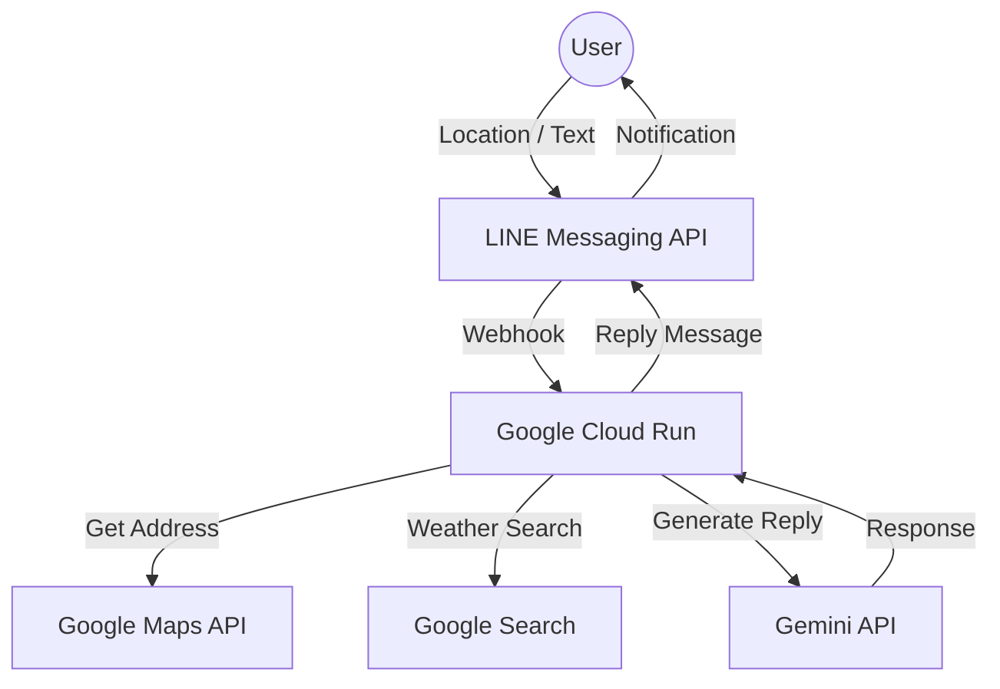

# ☀️カエルくんのお天気予報🐸 (Weather Frog Bot)

位置情報を送るだけで、その場所の天気や周辺情報を教えてくれる、頼れるカエルのLINE BOTです。
Google Maps API と Gemini API を組み合わせることで、単なる天気予報だけでなく、「現在地の詳細な住所」や「地図リンク」も即座に返信します。

## 🚀 主な機能

1. **位置情報からの天気予報**
    * LINEの「位置情報送信」機能に対応。送られた座標（緯度・経度）から正確な住所を特定し、その場所のピンポイント天気を教えます。
2. **Google Maps 連携**
    * **Reverse Geocoding**: 座標から「○○県○○市」などの地名を自動取得。
    * **Google Maps リンク生成**: チャット内のリンクから、すぐに地図アプリを開けます。
3. **自然言語による天気検索**
    * 「明日の東京の天気は？」のように話しかけるだけでも、Geminiが検索して答えてくれます。
4. **ペルソナ「ケロくん」**
    * 「〜だケロ！」「〜ケロよ」という親しみやすい語尾で、雨の日でも楽しくなるような会話を提供します。

## 🛠 技術スタック (Tech Stack)

* **Language**: Python 3.10+
* **Framework**: FastAPI
* **AI Model**: Google Gemini 2.5 Flash
* **Map Service**: Google Maps Platform (Geocoding API, Places API)
* **Interface**: LINE Messaging API
* **Library**: requests, line-bot-sdk, etc.

## 🏗 アーキテクチャ (Architecture)

## 📸 スクリーンショット

| 朝の通知 (天気＆服装)・位置情報からの検索 | Google Maps |
| :---: | :---: |
|  |  |

---
Developed by miki-mini