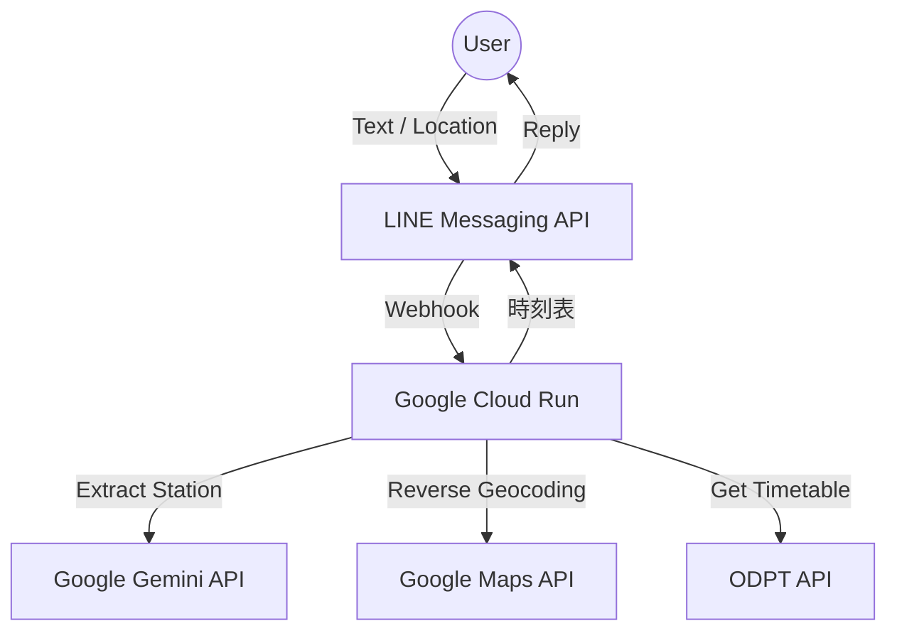

🦡 もぐら駅長の時刻表BOT (Mole Station Master Bot)

# 🦡 もぐら駅長の時刻表BOT (Mole Station Master Bot)

| 一般的な乗換アプリ | もぐら駅長 |
| :--- | :--- |
| アプリ起動→入力→検索 | **LINEで一言「新宿」と送るだけ！** |
| 現在地周辺を地図で確認 | **位置情報を送れば最寄り駅を即答！** |

「次の電車、何時だっけ？」を瞬時に解決。地下に詳しい「もぐら駅長」が、あなたの代わりにリアルタイムな時刻表を案内してくれるLINE BOTです。
曖昧な入力でもGeminiが駅名を推測し、ODPT（公共交通オープンデータ）APIを通じて正確な発車時刻をお知らせします。

> [!WARNING]
> **APIの制限について**
> 使用しているODPT APIのプラン（無料枠等）によっては、**JR東日本**や**京王電鉄**などの一部事業者の時刻表データが取得できない（空で返却される）場合があります。
> この場合、駅は見つかっても「データがないモグ」と表示されることがあります。

## 📎 🚀 主な機能

1. **AI駅名検索アシスタント 🧠**
   - 「神保町駅の時間を教えて」や「新宿！」と雑に送っても、Geminiが文脈から駅名だけを抽出。
   - 正確な駅名を入力しなくても、AIが意図を汲み取って検索します。
2. **現在地から最寄り駅検索 📍**
   - LINEの「位置情報」ボタンから現在地を送るだけで、Google Maps APIを使って一番近い駅を特定。
   - 「ここどこ？」と思った時でも、すぐに最寄りの電車時間を調べられます。
3. **リアルタイム時刻表取得 🕒**
   - ODPT（公共交通オープンデータセンター）の公式APIと連携。
   - 平日・土曜・休日のダイヤを自動判定し、現在時刻以降の直近5本の電車をリストアップします。

## 🖼️ 実際の動作イメージ

| 駅名検索 | 位置情報検索 |
| :--- | :--- |
|  |  |
| **User:** 神保町の電車！  **もぐら:** 🦡 【神保町 (Toei)】の時刻表だモグ！ 🕒 14:05 → 本八幡 🕒 14:08 → 新宿 ... | **User:** (位置情報を送信)  **もぐら:** 🦡 最寄りは「新宿駅」だモグ！  駅名を送ってくれたら時刻表を見せるモグ！ |

## 🛠️ 技術スタック (Tech Stack)

- **Language:** Python 3.10+
- **Framework:** FastAPI
- **AI Model:** Google Gemini (Text extraction)
- **Data Source:** ODPT API (Association for Open Data of Public Transportation)
- **Location Service:** Google Maps API (Places Nearby)
- **Interface:** LINE Messaging API

## 🏗️ アーキテクチャ (Architecture)

---
Developed by miki-mini