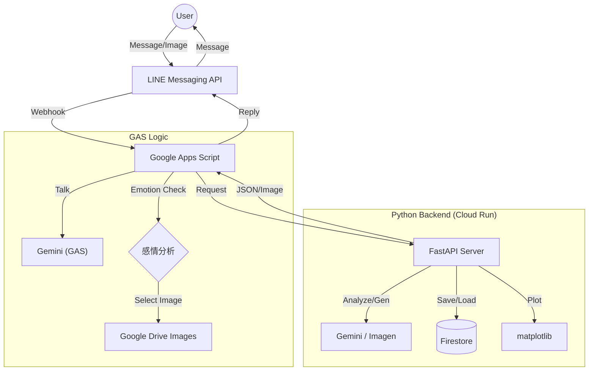

# 🦉 フクロウ教授 - ハイブリッドAIボット / Professor Owl

| おしゃべりフクロウ（初代） | フクロウ先生 | **フクロウ教授（現在）** |
| :---: | :---: | :---: |
|  |  |  |
| 雑談のみ | **画像認識**追加 | **GAS + Python** ハイブリッド |

**「健康管理（Python）」** と **「豊かな会話（GAS）」** を両立させた、ハイブリッド構成のAIアシスタントです。
Google Apps Script (GAS) が会話のフロントエンドを、Google Cloud Run (Python) が重い計算処理（画像分析・グラフ生成）を担当する分業体制をとっています。

---

## 🛠 機能詳細 (Features)

### 🗣️ こだわりの会話機能 (Powered by GAS)
GAS側でGeminiを呼び出し、ユーザーの言葉に対する感情を分析。**4種類の表情**を使い分けて返信します。

### 🎨 お絵描き機能 (Image Generation)
*   **「描いて：○○」** と送ると、PythonサーバーのImagenモデルを呼び出し、画像を生成して返します。

### 🍽️ 料理画像分析 & カロリー自動記録 (Powered by Python)
1.  **見る:** 料理の写真を送信
2.  **分析:** Gemini 2.5 Flashが料理名とカロリーを特定
3.  **記録:** Firestoreに自動保存
4.  **返答:** 「これは美味しそうなカツ丼ですね！約900kcalです」

### ⚖️ 体重 & グラフ管理 (Powered by Python)
*   数値を送ると体重として記録（例: 「60.5」）
*   **「グラフ」**: 体重の推移を折れ線グラフで表示
*   **「カロリー」**: 摂取カロリーを棒グラフで表示

[サンプルデータ](../seed_owl_data.py)
---

## 🏗 アーキテクチャ (Hybrid Architecture)

GASを「司令塔」として、Pythonサーバーを「計算センター」として使う構成です。

---

## 🔧 技術スタック (Tech Stack)

| カテゴリ | 技術 | 役割 |
|:---|:---|:---|
| **Frontend** | **Google Apps Script (GAS)** | LINE連携、会話ロジック、感情分析 |
| **Backend** | **Python (FastAPI)** | 画像分析、グラフ生成、画像生成 |
| **Infrastructure** | **Google Cloud Run** | Pythonサーバーのホスティング |
| **Database** | **Google Cloud Firestore** | 体重・カロリーデータの保存 |
| **AI (Text)** | **Gemini 2.5 Pro/Flash** | 会話生成、感情分析 |
| **AI (Vision)** | **Gemini 2.5 Flash** | 料理画像のカロリー推定 |
| **AI (Image)** | **Imagen 3.0** | 画像生成機能 |

---

## 📡 API エンドポイント (Python Side)

GASから呼び出されるバックエンド機能です。

| Method | Endpoint | 説明 |
|:---|:---|:---|
| POST | `/analyze_image/` | 料理画像を分析してカロリーを記録 |
| POST | `/record/weight` | 体重を記録 |
| GET | `/graph/weight` | 体重グラフ（PNG）を取得 |
| GET | `/graph/calories` | カロリーグラフ（PNG）を取得 |
| POST | `/generate-image` | お絵描き機能（Imagen） |

---

## 📢 クレジット

*   **Character:** オリジナル（フクロウ教授）
*   **System Design:** Hybrid Architecture (GAS + Cloud Run)