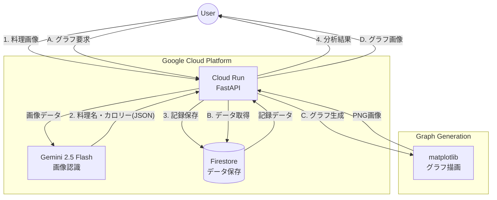

# 🦉 フクロウ教授 - 健康管理アシスタント / Professor Owl

| おしゃべりフクロウ（初代） | フクロウ先生 | **フクロウ教授（現在）** |
| :---: | :---: | :---: |
|  |  |  |
| 雑談のみ | **画像認識**追加 | **グラフ生成**追加 |

**「画像認識」×「データ記録」×「グラフ生成」** を組み合わせた、健康管理AIボットです。
動物シリーズで一番最初に作ったボットで、機能追加を重ねて「教授」に昇格しました。
料理の写真を送るだけでカロリーを自動記録し、体重の推移もグラフで可視化してくれます。

---

## 🆙 進化の歴史 (Evolution History)

### 🐣 Phase 1: おしゃべりフクロウ
最初はただの雑談ボット。テキストで話しかけると返事をするだけでした。

### 📚 Phase 2: フクロウ先生
Geminiの画像認識機能を導入。料理の写真を送ると「これは○○ですね、約○○kcalです」と教えてくれるように。

### 🎓 Phase 3: フクロウ教授（現在）
Firestoreでデータを永続化し、matplotlibでグラフを生成。
カロリーと体重の推移を**視覚的に確認**できるようになりました。

---

## 🛠 機能詳細 (Features)

### 🍽️ 料理画像分析 & カロリー自動記録
1. **見る:** 料理の写真をGemini 2.5 Flashに送信
2. **分析:** 料理名とカロリーをJSON形式で取得
3. **記録:** Firestoreに自動保存（日付・料理名・カロリー）
4. **返答:** 温かみのあるメッセージで結果をお知らせ

### ⚖️ 体重記録
- 体重を送信すると、その日の記録としてFirestoreに保存
- 同じ日に複数回記録すると上書き（最新値を保持）

### 📊 グラフ生成
- **体重グラフ:** 直近7日間の体重推移を折れ線グラフで表示
- **カロリーグラフ:** 日ごとの摂取カロリーを棒グラフで表示
- matplotlibで生成し、画像として返却

---

## 📱 画面イメージ

| 料理分析 | 体重グラフ | カロリーグラフ |
| :---: | :---: | :---: |
|  |  |  |
| 写真を送るだけで カロリー自動記録 | 体重の推移を 折れ線グラフで確認 | 日々の摂取カロリーを 棒グラフで可視化 |

---

## 🔧 技術スタック (Tech Stack)

| 項目 | 技術 |
|:---|:---|
| Language | Python 3.10+ |
| Framework | FastAPI |
| AI Model | Google Gemini 2.5 Flash (Vertex AI) |
| Database | Google Cloud Firestore |
| Visualization | matplotlib + japanize_matplotlib |
| Data Processing | pandas |
| Infrastructure | Google Cloud Run |

---

## 🏗 アーキテクチャ (Architecture)

```mermaid
graph TD
    User((User))

    subgraph Google Cloud Platform
        CR[Cloud Run<br/>FastAPI]
        Gemini[Gemini 2.5 Flash<br/>画像認識]
        FS[(Firestore<br/>データ保存)]
    end

    subgraph Graph Generation
        MPL[matplotlib<br/>グラフ描画]
    end

    %% 料理分析フロー
    User -- "1. 料理画像" --> CR
    CR -- "画像データ" --> Gemini
    Gemini -- "2. 料理名・カロリー(JSON)" --> CR
    CR -- "3. 記録保存" --> FS
    CR -- "4. 分析結果" --> User

    %% グラフ生成フロー
    User -- "A. グラフ要求" --> CR
    CR -- "B. データ取得" --> FS
    FS -- "記録データ" --> CR
    CR -- "C. グラフ生成" --> MPL
    MPL -- "PNG画像" --> CR
    CR -- "D. グラフ画像" --> User
```

---

## 📡 API エンドポイント

| Method | Endpoint | 説明 |
|:---|:---|:---|
| POST | `/analyze_image/` | 料理画像を分析してカロリーを記録 |
| POST | `/record/weight` | 体重を記録 |
| GET | `/graph/weight` | 体重グラフ（PNG）を取得 |
| GET | `/graph/calories` | カロリーグラフ（PNG）を取得 |

---

## 📢 クレジット

* **Character:** オリジナル（フクロウ教授）
* **Visualization:** matplotlib + japanize_matplotlib