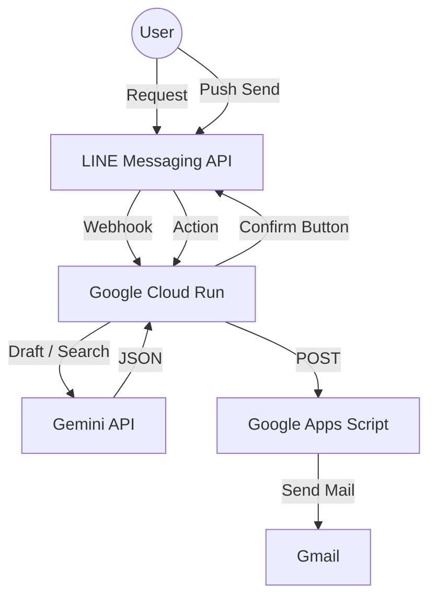

# 🐧 スーパー秘書ペンギン🐧 (Secretary Penguin Bot)

| 普通の秘書 | スーパー秘書へパワーアップ |
|:---:|:---:|
|  |  |
| メール代行のみ | **お店選び・手土産提案も可能！** |

メールの下書き作成から、お店選び・手土産の相談まで。
忙しいあなたをサポートする、頼れるAIコンシェルジュBOTです。
LINEで指示を出すだけで、Geminiがビジネスメールを推敲したり、接待に最適なお店をリサーチしてくれます。
✨ カルーセル表示による提案 (Carousel UI) お店や手土産の検索結果を、横にスクロールできる「カード形式（カルーセル）」で表示します。 文字だけの羅列ではなく、複数の候補をスワイプして直感的に比較でき、ボタン一つでGoogleマップを開けます。

## 🚀 主な機能

1.  **AIメール作成アシスタント** 📧
    * 「宛先・件名・本文」を雑に送るだけで、AIがきちんとしたビジネスメールに修正（推敲）します。
    * 「送信」ボタンを押すと、GASを経由して実際にGmailからメールを送信します。
2.  **コンシェルジュ検索** 🎩
    * 「接待：大阪で静かな和食」のように頼むと、TPOに合わせたお店を3つ提案してくれます。
    * 提案後、カード形式の表示にすることで、すぐにGoogleマップを開けるボタンを表示します。
3.  **手土産相談** 🎁
    * 「手土産：甘くないもの 3000円」などの相談にも、具体的な商品名と理由を挙げて答えます。

| メール作成 | コンシェルジュ |
|:---:|:---:|
|  |  |

## 🛠 技術スタック (Tech Stack)

* **Language**: Python 3.10+
* **Framework**: FastAPI
* **AI Model**: Google Gemini 2.5 Flash
* **Mail Backend**: Google Apps Script (Gmail API)
* **Interface**: LINE Messaging API (Template Message)

## 🏗 アーキテクチャ (Architecture)

---
Developed by miki-mini