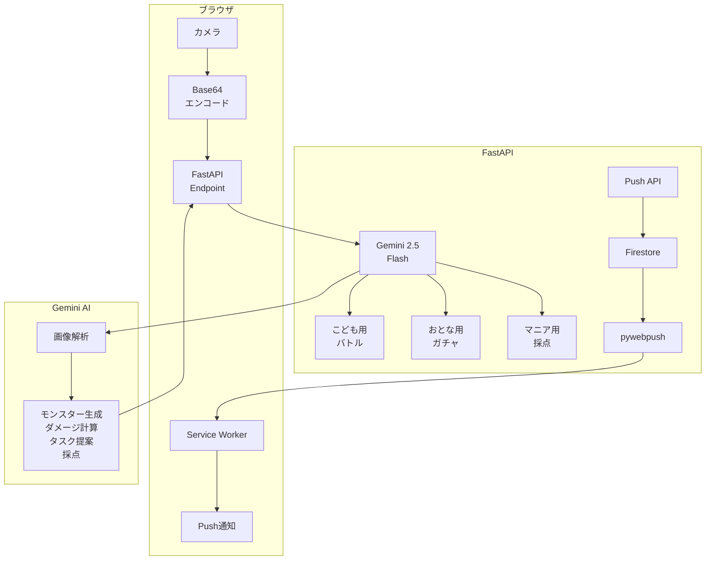

# 🦝 Raccoon Clean - アライグマのお片付け


**「片付け嫌だな…」から「片付けたくて眠れない！」へ**

子供も大人も片付けって苦手な人多いですよね。小さい子供に「1番嫌なことは？」と聞いたら「片付け！」と即答されたのを聞いて作ることにしました！

**片付けたくて眠れなくなる！！** を目指すアプリです😽

私自身が片付け好きで、「あそこ片付けようかな？」って寝る前に思うと眠れなくなるタイプ。そんな「片付けたくて眠れない」ワクワク感を、皆にも片付け好きになって欲しいと企画しました。

**ギャグ要素もあり楽しくお片付け♪**

## ✨ Features

### 🆕 3つのモード

- 🎮 **こども用バトル**: 散らかった部屋をスキャンしてモンスター生成、片付けで攻撃！RPG風バトル
- ⏳ **おとな用ガチャ**: 15分で終わる小タスクを3つ提案、何からやるか迷ったらガチャで決めよう
- 📏 **マニア用**: 収納の「シンデレラフィット率」をAIが採点、目指せコンプリート率100%

### その他機能

- 🔔 **Web Push通知**: アライさんからのお片付けリマインダー
- 🦝 **アライさんメモ**: ランダム表示される豆知識（ギャグ要素満載）
- 📸 **カメラ連携**: スマホのカメラで簡単撮影
- 🌙 **ダークモード**: 洗練されたUIデザイン

| こども用バトル | おとな用ガチャ | マニア用 |
|:--------:|:--------:|:--------:|
|  |  |  |

## 🎯 How to Play

### こども用バトル 🎮

1. **部屋をスキャン**: カメラで散らかった部屋を撮影
2. **モンスター出現**: 散らかり具合から「ゴミゴミ・モンスター」が生成される
3. **片付ける**: 実際に部屋を片付ける
4. **攻撃！**: 片付けた後の部屋を撮影すると、ダメージを与えられる
5. **倒すまで繰り返し**: モンスターのHPが0になるまで片付け続けよう！

**例**:
```
モンスター「モフモフリュックン」が現れた！
HP: 380/380

[片付け後]
「このカバンはきちんと整理されているね！30ダメージ！」
HP: 350/380

次のアドバイス: 床に散らばっている本も片付けよう！
```

### おとな用ガチャ ⏳

1. **部屋を見せる**: カメラで部屋を撮影
2. **ガチャを回す**: AIが15分タスクを3つ提案
3. **選んで実行**: やりたいタスクを1つ選ぶ
4. **完了報告**: 完了ボタンを押すとアライさんが全力で褒めてくれる

**例**:
```
今日のミッション候補:
1. テーブルの上のレシートを捨てる (5分)
2. ソファの服をランドリーバスケットに (3分)
3. 床のペットボトルを拾う (2分)

[完了後]
「素晴らしい！あなたの判断力と実行力に脱帽です🎩✨」
```

### マニア用 📏

1. **収納を撮影**: 棚や引き出しの写真を撮る
2. **AIが採点**: シンデレラフィット率を100点満点で評価
3. **改善提案**: マニアックなアドバイスを受け取る

**例**:
```
Score: 87%

分析結果:
カテゴリ分けは完璧です。

改善提案:
右上の棚に3cmの隙間があります。
無印良品のポリプロピレン小物ケース（約8×6×4cm）を
追加すると、フィット率が95%に向上します。
```

## 🚀 Getting Started

### Prerequisites

- モダンなWebブラウザ (Chrome, Firefox, Safari等)
- Webカメラ
- Node.js (開発時のみ必要)

### Installation

```bash
# リポジトリをクローン
git clone https://github.com/your-username/fish-aquarium.git

cd fish-aquarium

# 依存パッケージをインストール
npm install

# 開発サーバーを起動
npm start
```

ブラウザで `http://localhost:8080` を開いてください。

### Static Hosting

静的ファイルなので、そのままホスティングサービスで公開できます。

```bash
# ビルド (必要に応じて)
npm run build

# publicフォルダをホスティングサービスにデプロイ
```

対応サービス:
- Netlify
- Vercel
- GitHub Pages
- Firebase Hosting
- Google Cloud Run

## 🛠️ Tech Stack

### Core Technologies

- **AI**: Gemini 2.5 Flash (画像解析・テキスト生成)
- **Backend**: FastAPI (Python)
- **Database**: Firestore (Push購読情報)
- **Frontend**: Vanilla JavaScript
- **Notification**: Web Push API + Service Worker
- **Auth**: VAPID (Web Push認証)
- **Deploy**: Cloud Run (想定)

## 🏗️ Architecture



### API Endpoints

| Endpoint | Method | 説明 |
|----------|--------|------|
| `/api/raccoon/battle/start` | POST | モンスター生成 |
| `/api/raccoon/battle/attack` | POST | 攻撃（ダメージ計算） |
| `/api/raccoon/adult/gacha` | POST | 15分タスク提案 |
| `/api/raccoon/adult/complete` | POST | タスク完了・褒める |
| `/api/raccoon/mania/analyze` | POST | シンデレラフィット採点 |
| `/api/raccoon/push/subscribe` | POST | Push通知購読 |
| `/api/raccoon/push/send` | POST | Push通知送信 |


## 📂 Project Structure

```
raccoon-clean/
├── static/
│   ├── raccoon.html           # メインHTML
│   ├── raccoon_sw.js          # Service Worker
│   └── images/
│       ├── raccoon_battle.jpg     # こども用バトル画像
│       ├── raccoon_gacha.png      # おとな用ガチャ画像
│       ├── raccoon_mania.jpg      # マニア用画像
│       └── raccoon_icon.png       # 通知アイコン
├── animals/
│   └── raccoon.py             # FastAPI エンドポイント
├── main.py                    # FastAPI サーバー
├── requirements.txt
└── README.md
```

## 🔧 Implementation Details

### 1. Gemini Visionで画像解析

```python
@router.post("/api/raccoon/battle/start")
async def start_battle(req: ImageRequest):
    """部屋の画像からモンスターを生成"""
    model = get_gemini_model()

    prompt = """
    部屋の画像（散らかり具合）を分析して、
    その汚さを具現化した「ゴミゴミ・モンスター」を生成してください。

    JSON形式で出力:
    {
      "monster_name": "散らかりの王・クツシタ",
      "monster_level": 15,
      "monster_hp": 300,
      "description": "脱ぎっぱなしの靴下が原因で生まれた"
    }
    """

    response = model.generate_content(
        [prompt, image_part],
        generation_config={"response_mime_type": "application/json"}
    )

    return json.loads(response.text)
```

### 2. Before/After差分でダメージ計算

```python
@router.post("/api/raccoon/battle/attack")
async def attack_monster(req: BattleAttackRequest):
    """片付け後の画像でダメージ計算"""
    prompt = """
    「片付け後の部屋」を分析してダメージを計算。

    判定基準：
    - 床が見えてきたか？
    - モノが減ったか？
    - 整理整頓されたか？

    JSON形式で出力:
    {
        "damage": 50,
        "message": "すごい！床が見えてきた！50ダメージ！",
        "advice": "次は本を本棚に戻そう！"
    }
    """

    response = model.generate_content([prompt, before_part, after_part])
    return json.loads(response.text)
```

### 3. Web Push通知

```javascript
// Service Worker (raccoon_sw.js)
self.addEventListener('push', function (event) {
    const data = event.data.json();
    const title = "🦝 アライさんからのお知らせ";
    const message = data.body || "お片付けの時間だよ！";

    event.waitUntil(
        self.registration.showNotification(title, {
            body: message,
            icon: "/static/raccoon_icon.png"
        })
    );
});
```

## 🦝 アライさんメモ（ギャグ要素）

アプリの下部には、ランダムで以下のような豆知識が表示されます：

```javascript
const memos = [
    {
        title: "【片付けのプロ】整えのアライさん",
        content: "「あなたの『要らない』は、私の『お宝』（かもしれない）。」<br>森の奥からやってきた、異色の片付けコンサルタント。"
    },
    {
        title: "アライ流・野生収納術 1：洗う儀式",
        content: "「とりあえず洗う」儀式。<br>スマホやリモコンも洗おうとするので注意が必要です。"
    },
    // ... 他8つのメモ
];
```

## 🚀 Getting Started

### Prerequisites

- Python 3.9+
- Google Cloud Project (Firestore, Vertex AI)
- VAPID keys (Web Push用)

### Installation

```bash
# リポジトリをクローン
git clone https://github.com/your-username/raccoon-clean.git
cd raccoon-clean

# 依存パッケージをインストール
pip install -r requirements.txt

# 環境変数設定
cp .env.example .env
# .envファイルを編集してVAPID_PRIVATE_KEYを設定
```

### 環境変数

```.env
VAPID_PRIVATE_KEY=your_vapid_private_key
GOOGLE_APPLICATION_CREDENTIALS=path/to/service-account.json
```

### 開発サーバーを起動

```bash
uvicorn main:app --reload --port 8080
```

ブラウザで `http://localhost:8080/static/raccoon.html` を開いてください。

## ⚡ Performance

| 項目 | 値 |
|------|-----|
| 画像解析速度 | ~2-3秒 |
| API レスポンス | ~3-5秒 |
| Push通知遅延 | <1秒 |
| モバイル対応 | ✅ |

## 🐛 Known Issues

- [ ] 照明が暗いと画像解析の精度が下がる場合がある
- [ ] モンスターHPの調整が必要な場合がある

## 🔮 Future Enhancements

### 機能追加案

- [ ] **ランキング機能**: 友達とモンスター討伐数を競う
- [ ] **実績システム**: 「連続7日片付け」などのバッジ
- [ ] **AIコーチング**: 片付けの習慣化をサポート
- [ ] **音声認識**: 「アライさん、次何すればいい？」で提案
- [ ] **定期通知**: 毎日決まった時間にリマインダー

### 技術的改善

- [ ] **Gemini 2.0のマルチモーダル活用**: 音声での励まし
- [ ] **PWA化**: オフラインでも動作
- [ ] **多言語対応**: 海外展開
- [ ] **画像生成**: モンスターの見た目をAIで生成


## 🤝 Contributing

プルリクエストを歓迎します！

1. このリポジトリをフォーク
2. 機能ブランチを作成 (`git checkout -b feature/amazing-feature`)
3. 変更をコミット (`git commit -m 'Add amazing feature'`)
4. ブランチにプッシュ (`git push origin feature/amazing-feature`)
5. プルリクエストを開く

## 📝 License

このプロジェクトは MIT License の下でライセンスされています。

