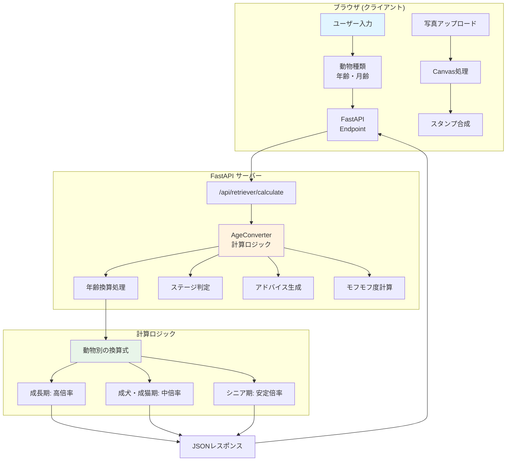

# 🐕 Watchdog Retriever - 見守りレトリバー

**ペットの年齢を人間換算で表示する無料Webアプリ**

「うちの子、人間でいうと何歳なの？」という素朴な疑問に答えるために作りました。
犬、猫、うさぎはもちろん、ゾウやペンギン、カピバラまで30種類以上の動物に対応！


## ✨ 主な機能

- 🐾 **30種類以上の動物に対応** - 犬（小・中・大型）、猫、うさぎ、ハムスター、鳥類、爬虫類、大型動物まで
- 📊 **年齢比較機能** - あなたとペットの年齢を視覚的に比較
- 📷 **記念フォト作成** - 写真に人間年齢のバッジを自動で付与
- 💡 **健康アドバイス** - 年齢に応じたケア情報と理学療法士視点のアドバイス
- 🎨 **モフモフ度判定** - 動物ごとのユニークな特性を数値化
- 💰 **完全無料** - AIコスト0円！計算ロジックだけで動作

## 🚀 デモ

[デモサイトはこちら](https://usagi-oekaki-service-1032484155743.asia-northeast1.run.app/static/retriever.html)

[📘 Zenn](https://zenn.dev/miki_mini/articles/816320cdacc065)

## 📸 スクリーンショット

| 🐕 | 🦝 | 🤖 |
|:---:|:---:|:---:|
|  |  |  |

## 🎯 なぜ作ったのか

私は子供の頃から色々な動物と暮らしてきました。今はうさぎを飼っているのですが、友人によく聞かれるのが「うさぎって、人間でいうと何歳なの？」という質問です。

犬や猫の年齢換算はよく見かけますが、うさぎやハムスター、ましてやゾウやペンギンとなると、情報が少ない…

そこで、**あらゆる動物の「人間年齢」がパッとわかるアプリ**を作りました。

多くのペットは人間より寿命が短いです。だからこそ、今この瞬間の年齢を知り、適切なケアをすることが大切だと考えています。

## 🏗 システムアーキテクチャ

### 全体構成図



### データフロー

**1. 年齢換算リクエスト**
```
ユーザー入力（動物種類 + 年齢） → /api/retriever/calculate
→ AgeConverter.convert() → 動物別ロジックで計算
→ JSON返却（人間年齢、ステージ、アドバイスなど）
→ UI更新（アニメーション付き）
```

**2. 記念フォト作成**
```
写真アップロード → Canvas API → 画像読み込み
→ 人間年齢バッジを右下に描画 → プレビュー表示
→ ダウンロード or SNSシェア
```

**3. 年齢比較**
```
飼い主年齢入力（任意） → ペット人間年齢と比較
→ 棒グラフの高さ計算 → アニメーション表示
→ 比較メッセージ生成（「〇歳先輩です！」など）
```

## 🛠 技術スタック

- **フロントエンド**: Vanilla JavaScript
- **バックエンド**: FastAPI (Python 3.9+)
- **デザイン**: レスポンシブ対応のモダンUI
- **API**: RESTful API
- **Canvas**: 画像加工機能

## 📦 インストール

### 必要な環境

- Python 3.9以上
- pip

### セットアップ

1. リポジトリをクローン
```bash
git clone https://github.com/yourusername/watchdog-retriever.git
cd watchdog-retriever
```

2. 依存関係をインストール
```bash
pip install -r requirements.txt
```

3. サーバーを起動
```bash
uvicorn main:app --reload
```

4. ブラウザで開く
```
http://localhost:8000
```

## 🐾 対応動物一覧

### 一般的なペット
- 🐕 小型犬、中型犬、大型犬
- 🐈 猫
- 🐇 うさぎ
- 🐹 ハムスター・小動物

### 鳥類
- 🐦 小鳥（インコ等）
- 🦜 中型鳥（オカメインコ等）
- 🦅 大型鳥（オウム等）
- 🦉 フクロウ
- 🦩 フラミンゴ
- 🐧 ペンギン

### 爬虫類・その他
- 🐢 リクガメ
- 🦎 ヤモリ・トカゲ
- 🐸 カエル

### 大型動物
- 🐘 ゾウ
- 🦒 キリン
- 🐋 クジラ

### プロジェクト・オールスターズ
- 🦝 アライグマ
- 🛀 カピバラ
- 🕳️ モグラ
- 🦊 キツネ
- 🦫 ビーバー
- 🦇 コウモリ
- 🦙 アルパカ
- 🦋 蝶々
- 🐿️ リス
- 🧍 ミーアキャット
- 🤖 ロボット

**合計30種類以上！**

## 💡 技術的な特徴

### 1. 精密な年齢換算ロジック

単純な掛け算ではなく、成長段階ごとに異なる倍率を適用しています。

**うさぎの例:**
```python
if total_years < 1:
    return int(total_years * 21)      # 1歳未満: 急成長
elif total_years < 2:
    return 21 + int((total_years - 1) * 6)  # 1-2歳: 成長鈍化
else:
    return 27 + int((total_years - 2) * 6)  # 2歳以降: 安定
```

**犬のサイズ別換算:**
```python
if animal_type == AnimalType.DOG_SMALL.value:
    return base_age + int(years_after_2 * 4)   # 小型犬: ゆっくり
elif animal_type == AnimalType.DOG_MEDIUM.value:
    return base_age + int(years_after_2 * 5)   # 中型犬: 中間
elif animal_type == AnimalType.DOG_LARGE.value:
    return base_age + int(years_after_2 * 7)   # 大型犬: 早い
```

### 2. AIコスト0円の秘密

このアプリは**生成AIを使っていません**！

- 計算ロジックはGeminiに書いてもらいましたが、実行時にはAIを呼び出しません
- 「匂いを嗅いで調査中...」は演出です（1.5秒の待機時間）
- ランニングコストはサーバー代のみ

```javascript
// 演出用の待機時間
document.getElementById('loading-overlay').style.display = 'flex';
await new Promise(r => setTimeout(r, 1500));
```

### 3. Canvas APIでの写真加工

```javascript
function drawCanvas(age) {
    // 画像を描画
    ctx.drawImage(uploadedImage, 0, 0, canvas.width, canvas.height);

    // 右下に円形バッジを描画
    ctx.beginPath();
    ctx.arc(badgeX + badgeW / 2, badgeY + badgeH / 2, badgeW / 2, 0, Math.PI * 2);
    ctx.fillStyle = "rgba(255, 255, 255, 0.8)";
    ctx.fill();

    // 年齢テキストを描画
    ctx.fillText(age + "歳", badgeX + badgeW / 2, badgeY + badgeH / 2 + 30);
}
```

### 4. 理学療法士視点の健康アドバイス

年齢に応じた具体的なケア情報を提供しています。

```python
pt_baby = "【PT視点】骨格形成の大事な時期。滑りやすいフローリングは関節形成不全のリスクになります。カーペットなどで足元を安定させましょう。"

pt_active = "【PT視点】筋肉量維持のため、平坦な道だけでなく、適度な坂道や砂利道など多様な地面を歩かせ、深層筋（インナーマッスル）を刺激しましょう。"

pt_senior = "【PT視点】関節可動域が狭くなりがちです。無理のない範囲でのストレッチや、温湿布（ホットパック）で血流を促してから動くのがおすすめ。"
```

## 📖 使い方

1. **動物の種類を選択**
   - ドロップダウンから30種類以上の動物から選択

2. **年齢を入力**
   - 「何歳？」と「何ヶ月？」を入力

3. **あなたの年齢を入力（任意）**
   - 比較機能を使いたい場合に入力

4. **診断ボタンをクリック**
   - 「匂いを嗅いで調査中...」のアニメーション後、結果が表示されます

5. **記念フォトを作成（任意）**
   - 写真をアップロードすると、右下に年齢バッジが付きます
   - 画像保存やSNSシェアも可能

## 🎨 UI/UXの工夫

### 温かみのあるアースカラー

```css
:root {
    --primary-color: #8D6E63;      /* Warm Brown */
    --secondary-color: #D7CCC8;    /* Light Brown */
    --accent-color: #FF7043;       /* Warm Orange */
}
```

### カウントアップアニメーション

年齢が0から実際の値まで1ずつ増えていく演出で、ワクワク感を演出しています。

```javascript
function animateValue(id, start, end, duration) {
    const range = end - start;
    const increment = end > start ? 1 : -1;
    const stepTime = Math.abs(Math.floor(duration / range));
    let current = start;

    const timer = setInterval(function () {
        current += increment;
        document.getElementById(id).textContent = current;
        if (current == end) {
            clearInterval(timer);
        }
    }, stepTime);
}
```

### レスポンシブ対応

スマホでも快適に使える設計です。

## 🔧 API仕様

### POST /api/retriever/calculate

**リクエスト:**
```json
{
  "animal_type": "dog_small",
  "age_years": 3,
  "age_months": 6
}
```

**レスポンス:**
```json
{
  "human_age": 32,
  "stage": "Adult",
  "emoji": "🐕",
  "advice": {
    "title": "活動的な時期",
    "care": "定期的な運動を心がけましょう。",
    "checkup": "年1回の健康診断を。【PT視点】筋肉量維持のため..."
  },
  "fluffiness": {
    "label": "モフモフ度",
    "score": 85,
    "comment": "安定した上質な手触り。"
  }
}
```

## 📁 プロジェクト構成

```
watchdog-retriever/
├── main.py                 # FastAPIメインアプリケーション
├── routers/
│   └── retriever.py       # 年齢換算ロジック
├── static/
│   ├── retriever.html     # フロントエンド
│   └── images/
│       └── retriever_chart.jpg
├── requirements.txt       # Python依存関係
└── README.md
```

## 🤝 コントリビューション

プルリクエストを歓迎します！大きな変更の場合は、まずissueを開いて変更内容を議論してください。

1. このリポジトリをフォーク
2. フィーチャーブランチを作成 (`git checkout -b feature/AmazingFeature`)
3. 変更をコミット (`git commit -m 'Add some AmazingFeature'`)
4. ブランチにプッシュ (`git push origin feature/AmazingFeature`)
5. プルリクエストを開く

## 📝 今後の展開

- [ ] 成長記録機能（定期的に診断して成長グラフを作成）
- [ ] 多頭飼い対応（複数のペットをまとめて管理）
- [ ] 健康チェックリスト（年齢に応じた検診項目を提案）
- [ ] PWA化（アプリとしてインストール可能に）
- [ ] 多言語対応（海外のペットオーナーにも）

## 📄 ライセンス

このプロジェクトはMITライセンスの下で公開されています。詳細は[LICENSE](LICENSE)ファイルをご覧ください。

## 👤 作者

**miki-mini**

- GitHub: [@miki-mini](https://github.com/miki-mini)
- Google Cloud Innovators メンバー

## 🙏 謝辞

- 計算ロジックの作成にGeminiを活用しました
- 複数の獣医学資料を参照し、換算式を作成しました
- 実際のペットオーナーの方々からフィードバックをいただきました

---

**「うちの子、人間でいうと何歳なの？」**

この素朴な疑問に答えるために作った「見守りレトリバー」。
ゾウやペンギンを飼っている方も、是非使ってください𓃰

人間より寿命が短いからこそ、いい相棒として楽しく暮らしたいですよね。
マニアックな動物もこんな感じなんだーと発見してもらえたら幸いです。

**大切なのは、今この瞬間を一緒に楽しむこと。**
このアプリが、そのきっかけになれば嬉しいです🐕💕