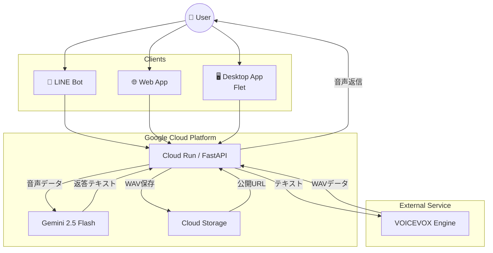
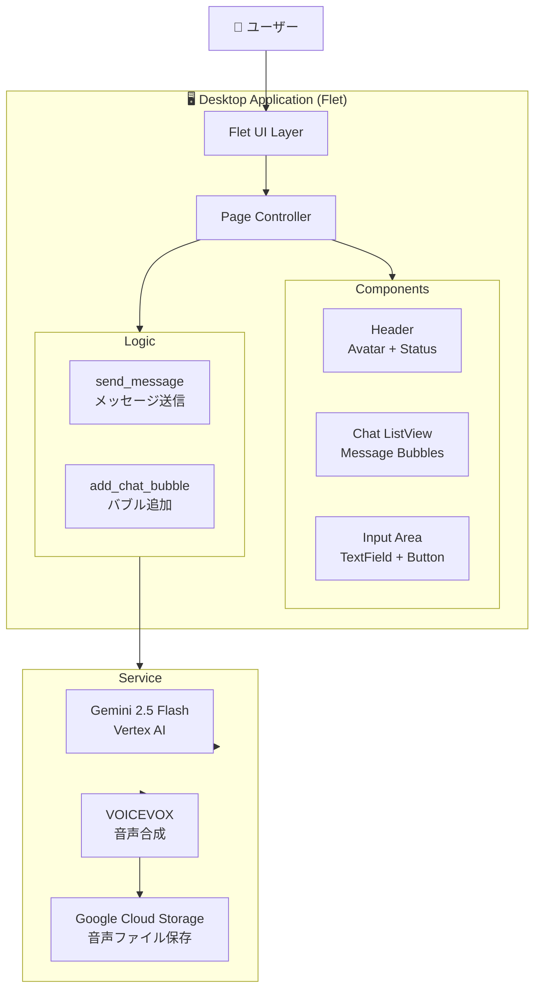

# 🤖 おしゃべり Voidoll (猫モード搭載型) 🐱 / Chatty Voidoll Cat Ver.

| 通常モード（旧） | **猫耳モード（新）**🐱 |
| :---: | :---: |
|  |  |
| **知的でクールな女性** | **クールなのに語尾が「にゃ」** |

**「音声認識」×「音声合成」×「人格生成」** を組み合わせた、対話型AIボットです。
当初はクールな秘書AIとして開発されましたが、アップデートにより「猫耳」🐱が生えました。
高度な知能を持ちながら、どうしても語尾に「にゃ」がついてしまう愛らしいアンドロイドとして、あなたと音声＆テキストでお話しします。

---

## 🆙 進化ポイント (Evolution Highlights)

### 🚀 1. マルチモーダル対話へ進化
以前は「音声」しか聞き取れませんでしたが、現在は「テキストチャット」にも対応しました。
電車の中では文字で、お家では声で。いつでもVoidoll猫ちゃんと会話が可能です。

### 🐈 2. 「猫語翻訳」機能の実装
ユーザーが「ニャー」「ミャー」と鳴き真似をして音声を送ると、Geminiの高度な推論能力で「猫語」を翻訳して返事をします。
（例：「お腹が空いたんですにゃ？ しょうがないご主人様だにゃ...」）

### 🖥️ 3. デスクトップアプリ版をリリース
**NEW!** Fletを使ったWindowsデスクトップアプリとしても動作するようになりました。
LINEだけでなく、PCのアイコンダブルクリックで起動できるターミナル風UIでもVoidollと会話できます。

---

## 🛠 機能詳細 (Features)

### 🎙️ 音声対話 (Voice Interaction)
1.  **聴く:** ユーザーの音声メッセージを受け取り、Gemini 2.5 Flash で高速に文字起こし＆意味理解を行います。
2.  **考える:** 「知的だが語尾は猫」という特殊なプロンプトに従って返答を生成します。
3.  **喋る:** 生成されたテキストを **VOICEVOX** エンジンに送り、流暢な日本語音声を生成。Google Cloud Storage (GCS) 経由でLINEにボイスメッセージを返します。

### 📝 テキスト対話 (Text Chat)
* 日常の雑談からPythonのコード相談まで、テキストでも幅広く対応します。
* どんなに真面目な技術的な話をしても、語尾は必ず「〜だにゃ」になります（仕様です）。

### 🖥️ デスクトップアプリ版 (Desktop App)
* **Framework:** Flet (Python製GUIフレームワーク)
* **UI:** ネオングリーン/黒のターミナル風デザイン
* **Platform:** Windows Desktop (`.exe`ファイルとして起動可能)
* **Features:**
  - テキストチャット対応
  - リアルタイムAI返答（Gemini 2.5 Flash）
  - 音声合成対応（VOICEVOX）
  - Material Design ベースのUI

---

## 📱 画面イメージ (Screenshots)

### LINE版


「疲れたにゃ...」と話しかけると優しい声で励ましてくれます🐈
文字での相談もOK。猫耳アンドロイドが即レス！

### Desktop版（Flet）


*ターミナル風のネオングリーン/黒のUIで、テキストチャットができます*

---

## 📢 クレジット / ライセンス
* **Voice:** [VOICEVOX:No.13 (Voidoll)](https://voicevox.hiroshiba.jp/)
* **Character:** #コンパス 【戦闘摂理解析システム】 (Voidoll)

---

## 🔧 技術スタック (Tech Stack)

### バックエンド（共通）
* **Language:** Python 3.10+
* **Framework:** FastAPI
* **AI Model:** Google Gemini 2.5 Flash (Multimodal)
* **Voice Engine:** VOICEVOX (Speaker ID: 89)
* **Cloud Storage:** Google Cloud Storage (Audio hosting)
* **Platform:** Google Cloud Run

### フロントエンド
* **LINE:** LINE Messaging API
* **Web:** HTML / CSS / JavaScript
* **Desktop:** Flet 0.25+ (Python GUI Framework)

---

## 🏗 アーキテクチャ (Architecture)

### 全体構成（マルチプラットフォーム）


**ポイント:**
- すべてのクライアント（LINE / Web / Desktop）が同じ VoidollService を共有
- AI と音声機能はクラウド側で処理
- デスクトップアプリは UI レイヤーだけを担当

### デスクトップアプリのアーキテクチャ


---

## 🚀 セットアップ (Setup)

### 1. 環境変数の設定
```bash
# .env ファイルを作成
GCP_PROJECT_ID=your-project-id
VOICEVOX_URL=http://localhost:50021
GCS_BUCKET_NAME=your-bucket-name
LINE_CHANNEL_SECRET=your-line-channel-secret
LINE_CHANNEL_ACCESS_TOKEN=your-line-access-token
```

### 2. 依存関係のインストール
```bash
pip install -r requirements.txt
```

### 3. デスクトップアプリの起動
```bash
# デスクトップアプリを起動
python desktop_app.py

# または、.exeファイルをビルド
flet build windows
```

---

## 📂 プロジェクト構成 (Project Structure)

```
voidoll/
├── main.py                 # FastAPI メインアプリ
├── core/
│   └── voidoll_service.py  # AI & 音声機能
├── desktop_app.py          # Flet デスクトップアプリ
├── static/                 # Web版の静的ファイル
│   ├── index.html
│   ├── style.css
│   └── script.js
├── images/                 # スクリーンショット
│   ├── voidoll.jpg
│   ├── voidoll2.jpg
│   └── desktop_screenshot.png
├── requirements.txt        # Python依存関係
└── README.md
```

---

## 🎯 使い方 (Usage)

### LINE版
1. LINEで友達追加（QRコード or ID: @xxx）
2. メッセージまたは音声を送信
3. Voidoll猫ちゃんが返信してくれます

### Web版
1. ブラウザで `https://your-app.run.app` にアクセス
2. テキストを入力して送信
3. リアルタイムでチャットできます

### Desktop版
1. `desktop_app.py` を実行、または `.exe` ファイルをダブルクリック
2. ターミナル風のウィンドウが開きます
3. テキストを入力してEnterキーで送信

---

## 🌟 今後の予定 (Roadmap)

- [ ] デスクトップ版に音声入力機能を追加
- [ ] スマホアプリ版（PWA）の開発
- [ ] 複数のキャラクター選択機能
- [ ] チャット履歴の保存機能
- [ ] カスタムプロンプト設定

---

## 📝 記事 (Articles)

この開発について詳しく解説した記事を公開しています：
- [ZENNの記事URL]

---

## 👨‍💻 開発者 (Developer)

Developed by **miki-mini** <small>feat. Antigravity</small>


---

## 📄 ライセンス (License)

MIT License

**Voice & Character:**
- VOICEVOX:No.13 (Voidoll)
- #コンパス 【戦闘摂理解析システム】 (Voidoll)