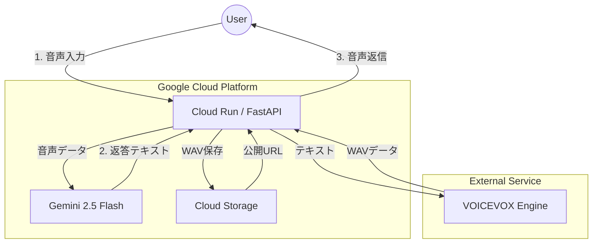

# 🤖 おしゃべり Voidoll (猫モード搭載型) 🐱/ Chatty Voidoll Cat Ver.

| 通常モード（旧） | **猫耳モード（新）**🐱 |
| :---: | :---: |
|  |  |
| **知的でクールな女性** | **クールなのに語尾が「にゃ」** |

**「音声認識」×「音声合成」×「人格生成」** を組み合わせた、対話型AIボットです。
当初はクールな秘書AIとして開発されましたが、アップデートにより「猫耳」🐱が生えました。
高度な知能を持ちながら、どうしても語尾に「にゃ」がついてしまう愛らしいアンドロイドとして、あなたと音声＆テキストでお話しします。

---

## 🆙 進化ポイント (Evolution Highlights)

### 🚀 1. マルチモーダル対話へ進化
以前は「音声」しか聞き取れませんでしたが、現在は「テキストチャット」にも対応しました。
電車の中では文字で、お家では声で。いつでもVoidoll猫ちゃんと会話が可能です。

### 🐈 2. 「猫語翻訳」機能の実装
ユーザーが「ニャー」「ミャー」と鳴き真似をして音声を送ると、Geminiの高度な推論能力で「猫語」を翻訳して返事をします。
（例：「お腹が空いたんですにゃ？ しょうがないご主人様だにゃ...」）

---

## 🛠 機能詳細 (Features)

### 🎙️ 音声対話 (Voice Interaction)
1.  **聴く:** ユーザーの音声メッセージを受け取り、Gemini 2.5 Flash で高速に文字起こし＆意味理解を行います。
2.  **考える:** 「知的だが語尾は猫」という特殊なプロンプトに従って返答を生成します。
3.  **喋る:** 生成されたテキストを **VOICEVOX** エンジンに送り、流暢な日本語音声を生成。Google Cloud Storage (GCS) 経由でLINEにボイスメッセージを返します。

### 📝 テキスト対話 (Text Chat)
* 日常の雑談からPythonのコード相談まで、テキストでも幅広く対応します。
* どんなに真面目な技術的な話をしても、語尾は必ず「〜だにゃ」になります（仕様です）。

---

## 📱 画面イメージ

「疲れたにゃ...」と話しかけると優しい声で励ましてくれます🐈
文字での相談もOK。猫耳アンドロイドが即レス！

---
## 📢 クレジット / ライセンス
* **Voice:** [VOICEVOX:No.13 (Voidoll)](https://voicevox.hiroshiba.jp/)
* **Character:** #コンパス 【戦闘摂理解析システム】 (Voidoll)

---

## 🔧 技術スタック (Tech Stack)

* **Language:** Python 3.10+
* **Framework:** FastAPI
* **AI Model:** Google Gemini 2.5 Flash (Multimodal)
* **Voice Engine:** VOICEVOX (Speaker ID: 2)
* **Cloud Storage:** Google Cloud Storage (Audio hosting)
* **Interface:** LINE Messaging API

---

## 🏗 アーキテクチャ (Architecture)

---
Developed by miki-mini <small>feat. Antigravity</small>