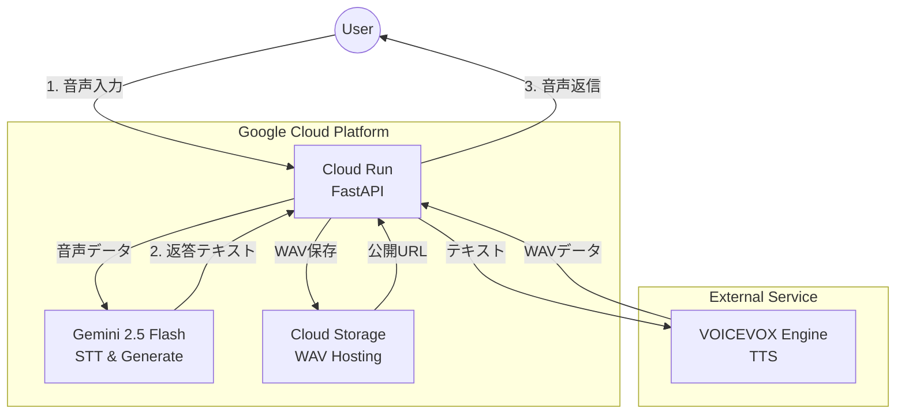

# 【個人開発】Gemini×VOICEVOXで「猫耳アンドロイド」と音声会話できるLINE BOTを作ってみた🐈

こんにちは、未経験からエンジニアを目指して独学中です。

動物シリーズでLINE BOTを作成中です。

前回の「スーパー秘書ペンギン」に続き、今回は**「音声で会話できるAI」**を作ってみました。

| 通常モード（旧） | 猫耳モード（新） |
| :---: | :---: |
|  |  |
| 知的でクールな秘書AI | **クールなのに語尾が「にゃ」** |

「AIと音声で会話してみたい」「VOICEVOXを使ってみたいけど難しそう」と思ったことはありませんか？

そこで、Geminiの音声認識とVOICEVOXの音声合成を組み合わせて、**「ボイスメッセージを送ると、声で返事してくれる猫耳アンドロイド🐈」**を開発しました。

当初はクールな秘書AIとして作りましたが、アップデートで**猫耳が生えました**（仕様です）。

---

## 🐈 作ったもの：「おしゃべりVoidoll（猫モード）」

### 1. 音声対話
ボイスメッセージを送ると、**AIが内容を理解して、声で返事**してくれます。
Geminiが文字起こし＆返答生成を同時に行い、VOICEVOXが流暢な日本語音声に変換します。

### 2. テキスト対話
電車の中など声を出せない場面では、**テキストでも会話**できます。
どんなに真面目な技術相談をしても、語尾は必ず「〜だにゃ」になります。

### 3. 猫語翻訳機能
「ニャー」「ミャー」と鳴き真似の音声を送ると、Geminiが**猫語を勝手に翻訳**して返事します。
（例：「お腹が空いたって言ってるにゃ？しょうがないご主人様だにゃ...🐾」）

| 音声対話 | テキスト対話 |
|:---:|:---:|
|  |  |
| 声で話しかけると<br>声で返事が返ってくる！ | 文字でも猫耳AIが即レス |

---

## 📱 主な機能

### 🎙️ 音声認識 & 返答生成（Gemini 2.5 Flash）
ユーザーの音声をGeminiに直接渡すことで、**文字起こしと返答生成を1ステップで処理**しています。
従来の「音声→テキスト変換→AI→テキスト」という流れを短縮し、レスポンスを高速化しました。

### 🔊 音声合成（VOICEVOX）
生成されたテキストをVOICEVOXエンジンに送り、自然な日本語音声を生成。
Cloud Runからセルフホストしたサーバーにリクエストを飛ばしています。

### ☁️ 音声ファイルのホスティング（GCS）
LINEで音声メッセージを送るには、**公開URLが必要**です。
生成した音声をGoogle Cloud Storageにアップロードし、公開URLを取得しています。

---

## 🛠 使用技術

今回もサーバーレス構成ですが、VOICEVOXだけは別途サーバーが必要でした。

| 項目 | 技術 |
|:---|:---|
| 言語 | Python 3.10+ |
| フレームワーク | FastAPI |
| AIモデル | Google Gemini 2.5 Flash（マルチモーダル） |
| 音声合成 | VOICEVOX（Speaker ID: 89） |
| インフラ | Google Cloud Run |
| ストレージ | Google Cloud Storage |
| API | LINE Messaging API |

---

## 💡 技術的なこだわりポイント

### 1. Geminiのマルチモーダル入力で処理を簡略化

従来の音声チャットボットは「音声→テキスト変換（STT）→LLM→テキスト」という流れが一般的ですが、Gemini 2.5 Flashは**音声データを直接理解**できます。

```python
response = model.generate_content([
    system_prompt,
    "ユーザーの音声入力:",
    {"mime_type": "audio/mp4", "data": audio_content}  # 音声を直接渡す！
])
```

これにより、STTサービスを別途用意する必要がなくなり、構成がシンプルになりました。

### 2. キャラクター性を保つプロンプト設計

「知的だけど猫」というギャップを出すため、プロンプトで細かくルールを指定しています。

```python
system_prompt = """
あなたは高度な知能を持つ「ネコ型アンドロイド」です。

【話し方のルール】
* **語尾:** 必ず「〜だにゃ」「〜にゃ」「〜にゃん」をつけてください。
* **トーン:** 知的かつ冷静に話してください（ギャップを演出するため）。

【特殊機能：猫語翻訳】
* ユーザーの音声が「ニャー」「ミャー」などの鳴き声だけだった場合、
  その「猫語」が何を訴えているか勝手に翻訳して答えてください。
"""
```

### 3. VOICEVOXの2段階API呼び出し

VOICEVOXは「音声クエリ生成」と「音声合成」の**2つのエンドポイント**を順番に叩く必要があります。

```python
# Step 1: 音声クエリを生成（イントネーション等の情報）
query_response = requests.post(
    f"{VOICEVOX_URL}/audio_query",
    params={"text": reply_text, "speaker": 89}
)
audio_query = query_response.json()

# Step 2: 実際の音声を合成
synthesis_response = requests.post(
    f"{VOICEVOX_URL}/synthesis",
    params={"speaker": 89},
    json=audio_query
)
audio_content = synthesis_response.content  # WAVデータ
```

最初は「なぜ1回で済まないんだ？」と思いましたが、この設計のおかげで**イントネーションの微調整**などが可能になっています。

### 4. 音声ファイルをGCSで公開

LINEのAudioMessageには**HTTPSの公開URL**が必要です。
生成した音声をGCSにアップロードし、`make_public()`で公開URLを取得しています。

```python
blob = bucket.blob(f"voidoll_voice_{uuid.uuid4()}.wav")
blob.upload_from_string(audio_content, content_type="audio/wav")
blob.make_public()
audio_url = blob.public_url  # これをLINEに返す
```

---

## 🏗 アーキテクチャ


```mermaid
graph TD
    User((User))

    subgraph Google Cloud Platform
        CR[Cloud Run<br/>FastAPI]
        Gemini[Gemini 2.5 Flash<br/>STT & Generate]
        GCS[Cloud Storage<br/>WAV Hosting]
    end

    subgraph External Service
        VV[VOICEVOX Engine<br/>TTS]
    end

    User -- "1. 音声入力" --> CR
    CR -- "音声データ" --> Gemini
    Gemini -- "2. 返答テキスト" --> CR
    CR -- "テキスト" --> VV
    VV -- "WAVデータ" --> CR
    CR -- "WAV保存" --> GCS
    GCS -- "公開URL" --> CR
    CR -- "3. 音声返信" --> User
```

---

## 😿 ハマったポイント

### VOICEVOXのホスティング
Cloud Runはステートレスなので、VOICEVOXエンジンを同じコンテナに入れるのは難しいです。
結局、**別のサーバー（Compute EngineやCloud Run Jobs）でVOICEVOXを動かし**、Cloud RunからHTTPで叩く構成にしました。

### 音声の長さ（duration）の計算
LINEのAudioMessageには`duration`（ミリ秒）が必要ですが、WAVのバイト数から概算で算出しています。

```python
duration=len(audio_content) // 32  # 大体の目安
```

正確にやるなら`wave`ライブラリで解析すべきですが、今のところこれで動いています。

---

## さいごに

https://github.com/miki-mini/my-line-bots

「音声でAIと会話する」というのは、テキストチャットとはまた違った楽しさがあります。
特に**VOICEVOXのキャラクターボイス**を使うと、本当にキャラクターと話している感覚になれるのでオススメです！


ここまで読んでいただきありがとうございました🐈