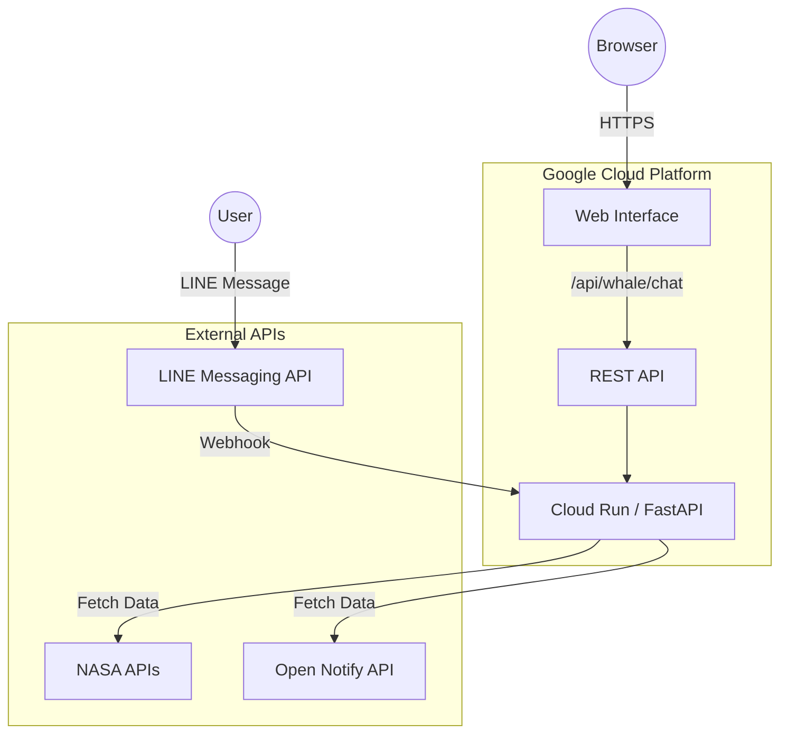

# 🐋 星くじら - 深宇宙からの光の便り (Star Whale)

宇宙の深淵を漂う「星くじら」が、あなたに天体写真と癒やしの言葉を届けるLINEボットです。
NASAのデータベースと連携し、実際の宇宙の姿を毎日お届けします。

**【New!】 Webアプリ版が公開されました！LINEなしでブラウザから試せます。**
👉 [Star Whale Web App](https://usagi-oekaki-service-1032484155743.asia-northeast1.run.app/star-whale)

---

## 🚀 主な機能

### 1. 🌌 NASA天体写真の配信
* 「写真を見せて」「画像」と話しかけると、NASAの **APOD (Astronomy Picture of the Day)** APIから、美しい天体写真を取得して送信します。
* 毎日更新されるNASAのライブラリから取得するため、日によって違う星雲や銀河の姿を楽しめます。

### 2. 🛰️ ISS追跡 & 宇宙の旅人
* **「ISS」**：「国際宇宙ステーション」の現在位置を地図付きで教えてくれます（`open-notify.org` 使用）。
* **「宇宙飛行士」**：今、宇宙空間に何人の飛行士がいるか、名前と一緒に教えてくれます。

### 3.  癒やしの対話 (Powered by Gemini)
* 「こんにちは」「疲れた」などの日常会話には、最新の生成AI (Gemini 2.5) が「星くじら」になりきって、毎回違う神秘的な言葉で返してくれます。
* あなたの言葉に寄り添い、少し哲学的で優しい宇宙の視点から返信します。

### 4. 🌐 Webアプリ & API (New!)
* **Web体験版**: LINEアプリがなくても、ブラウザ上で星くじらとチャットができます。
* **API公開**: `/api/whale/chat` エンドポイントを通じて、外部アプリからも星くじらの機能を利用可能です。
* **Swagger UI**: `/docs` にアクセスすると、APIの仕様書を確認・テストできます。

---

## 📱 画面イメージ

| 天体写真の受信 | ISSの追跡・Geminiと会話 | Webアプリ版 |
| :---: | :---: | :---: |
|  |  |  |
| beautiful nebula image... | 地図でお知らせ・Gemini🐋と会話 | ブラウザでチャット体験 |

## ⚠️ 開発メモ（既知の制限事項）

### 火星写真機能について（機能停止中）
NASAの火星ローバーAPI（Mars Rover Photos API）およびNASAサーバー上の画像リソースは、**LINEプラットフォームからのアクセス（画像プレビューのクローラー）をブロックする仕様**となっている可能性が高く、LINE上で正常に画像が表示されない現象が確認されました。
代替案（Wikimedia Commonsなどへの切り替え）も検討しましたが、ユーザー体験を最優先し、現在「火星」コマンドは機能を停止しています。

---

## 🛠 技術スタック (Tech Stack)

* **Language:** Python 3.10+
* **Framework:** FastAPI
* **Web Frontend:** HTML5 / CSS3 (Vanilla)
* **API:**
    * NASA APOD API (宇宙写真)
    * Open Notify API (ISS & Astronauts)
* **Interface:** LINE Messaging API / REST AGA
* **Platform:** Google Cloud Run

---

## 🏗 アーキテクチャ (Architecture)

---

Developed by miki-mini
